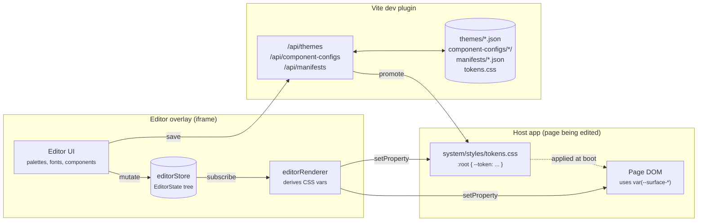

# Overview

## What this is

Live Tokens is a **design-token editor** plus a **runtime that drives CSS
custom properties from that editor**. A designer-developer opens the host app,
pops the editor overlay, and edits colors, typography, spacing, radii,
shadows, motion, and per-component slots. The page repaints on every change,
no reload required. The editor runs in an iframe layered over the page, so
editing happens in context: the user sees the real app, not a sandbox.

When the user is satisfied, they **promote** a saved theme to "production."
That writes the theme's variables straight into `src/system/styles/tokens.css`
and regenerates `fonts.css` from the resolved font registry. Production
builds bundle those CSS files as-is. The production bundle ships no editor
code, no JSON loader, and no runtime indirection.

## Shipping modes

The package supports two consumption shapes from a single source tree:

```
@motion-proto/live-tokens
├── starter mode — the repo itself, cloned as a degit template
└── library mode — npm-installed into an existing Svelte 5 + Vite app
```

**Starter.** `npx degit motionproto/live-tokens my-app`. The repo is also a
working app; `src/app/Home.svelte` is the only file the user needs to
replace.

**Library.** Install, register the Vite plugin, call `configureEditor`,
mount `<LiveEditorOverlay />` and the `/editor` route. The library exports
its surface through `src/editor/index.ts` (overlay, stores, theme service,
font helpers, plugin entry).

The two modes differ only in `src/app/main.ts`, `src/app/App.svelte`, and
`src/app/Home.svelte`. Everything under `src/editor/` and `src/system/`
ships in both.

## What problem this solves

Most token systems force a choice:

- **Edit-in-Figma.** Rich tooling, but the values you ship come from an
  export pipeline separate from the running app. Your team cannot see what
  the design looks like under real CSS, real fonts, real responsive
  breakpoints, or real component states.

- **Edit-in-code.** Ship-accurate, but every iteration means editing CSS
  files, saving, waiting for the build, and re-checking the page. Loop time
  runs five to ten seconds per change. That kills exploratory work.

Live Tokens splits the difference. The editor lives next to the running app
and writes the same CSS variables the app reads. Iteration is real-time, the
artifact is plain CSS, and production never imports the editor.

## The headline picture



Three takeaways:

1. **The runtime artifact is `:root` CSS variables.** Everything else sits
   upstream of that. Palettes derive into vars, theme files merge into vars,
   component aliases emit `var(...)` references that resolve to vars.

2. **The editor iframe writes to *both* its own document and the parent's.**
   That is how one editor running in an overlay can repaint the surrounding
   host page in real time without postMessage plumbing. See `cssVarSync.ts`
   and chapter 07.

3. **The dev-server plugin (`themeFileApi`) is what turns "save" into a
   JSON file on disk.** Production builds never run the plugin and never
   need it. By build time, the chosen theme has been baked into
   `tokens.css`.

## Top-level directory map

```
src/
├── app/                       — boot orchestration (starter only)
│   ├── main.ts                — calls each module's init()
│   ├── App.svelte             — top-level router shell
│   ├── Home.svelte            — placeholder home page
│   └── site.css               — themed h1/p/a defaults
├── demo/                      — Demo route content (starter only)
├── editor/                    — the entire editor (ships in both modes)
│   ├── core/                  — runtime: store, themes, persistence, routing
│   │   ├── cssVarSync.ts      — single CSS-var writer (self + parent doc)
│   │   ├── store/             — editorCore, editorStore, editorRenderer, editorPersistence
│   │   ├── themes/            — themeService, themeInit, slices/*, migrations/*, parsers/*
│   │   ├── components/        — componentConfigService, componentConfigKeys, componentPersist
│   │   ├── manifests/         — manifestService (preset bundles)
│   │   ├── palettes/          — oklch, paletteDerivation, tokenRegistry
│   │   ├── fonts/             — fontLoader, fontMigration, fontParse
│   │   ├── routing/           — minimal pushState router
│   │   └── storage/           — versionedFileResourceClient, storage helpers
│   ├── component-editor/      — per-component editors + scaffolding
│   │   ├── registry.ts        — single source of truth for the component list
│   │   ├── scaffolding/       — ComponentEditorBase, VariantGroup, LinkedBlock, …
│   │   └── <Foo>Editor.svelte — one per component
│   ├── ui/                    — neutral primitives + design-system editor surfaces
│   ├── overlay/               — LiveEditorOverlay, ColumnsOverlay
│   ├── pages/                 — Editor.svelte, ComponentEditorPage.svelte, EditorShell.svelte
│   └── styles/                — ui-editor.css, ui-form-controls.css
├── system/                    — the design system the library ships
│   ├── components/            — runtime components (Button, Dialog, …)
│   ├── styles/                — tokens.css, fonts.css, CONVENTIONS.md
│   └── assets/                — fonts, icons
vite-plugin/                   — themeFileApi entry + route table + file resources
themes/                        — *.json theme files (active + production pointers)
component-configs/<id>/        — *.json per-component alias/config files
manifests/                     — *.json preset bundles (theme + per-component refs)
```

The split between `editor/core/` and `editor/ui/` is deliberate.
`editor/core/` is plumbing: state, persistence, DOM sync, fetch helpers.
`editor/ui/` is the design-system editor surface: the tabs, the palette
editor, the color picker. `editor/component-editor/` is the *component*
editor surface: per-component slot editors and scaffolding for linked
blocks and variant groups.

## Where to go next

- **You're consuming the library.** Read 01, 04, 07.
- **You're adding a component.** Read 05, 08.
- **You're touching state, history, or persistence.** Read 03.
- **You're adding an `/api/*` route or a theme-format change.** Read 06,
  plus chapter 04's migration section.
- **You hit a contract that surprised you.** Read 10 first.
