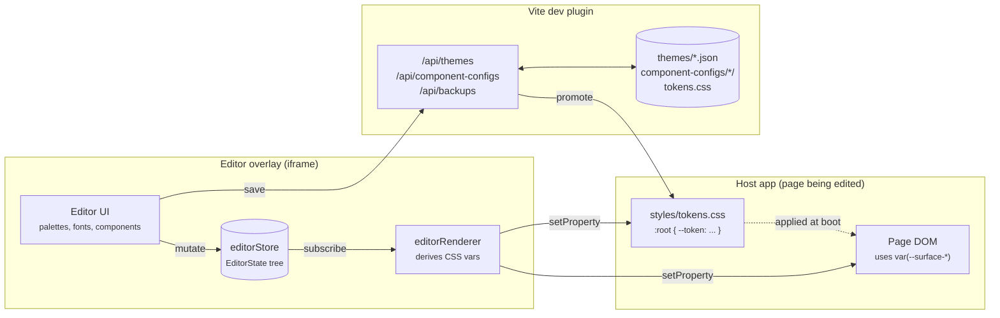

# Overview

## What this is

Live Tokens is a **design-token editor** plus a **runtime that drives CSS custom
properties from that editor**. A designer-developer opens the host app, pops the editor
overlay, edits colors / typography / spacing / radii / shadows / motion / per-component
slots, and the live page repaints every change without a reload. The editor itself runs
in an iframe layered over the page, so editing happens in-context: the user sees what
their app actually looks like, not a sandbox.

When the user is satisfied, they **promote** a saved theme to "production." That writes
the theme's variables straight into `src/styles/tokens.css` and regenerates `fonts.css`
from the resolved font registry. Production builds bundle these CSS files as-is — there
is no editor code, no JSON loader, and no runtime indirection in the production bundle.

## Shipping modes

The package supports two consumption shapes that share the same source tree:

```
@motion-proto/live-tokens
├── starter mode — the repo itself, used as a degit template
└── library mode — npm-installed into an existing Svelte 4 + Vite app
```

**Starter** — `npx degit motionproto/live-tokens my-app`. The repo as-shipped is also a
working app: `Home.svelte` is the only file the user is expected to replace.

**Library** — install, register the Vite plugin, call `configureEditor`, mount
`<LiveEditorOverlay />` and the `/editor` route. The library exports its surface through
`src/lib/index.ts` (overlay, stores, theme service, font helpers, plugin entry).

Differences between the two modes are confined to `src/main.ts`, `src/App.svelte`, and
the pages under `src/pages/`. Everything under `src/lib/`, `src/ui/`,
`src/component-editor/`, and `src/components/` ships in both.

## What problem this solves

Most token systems force a choice:

- **Edit-in-Figma**: rich tooling, but the values you ship are derived from an export
  pipeline that's separate from the running app. The team you're collaborating with
  can't see what the design actually looks like under real CSS, real fonts, real
  responsive breakpoints, real component states.

- **Edit-in-code**: ship-accurate, but every iteration requires editing CSS files,
  saving, waiting for the build, and re-checking the page. Loop time is ~5–10 seconds
  per change, which kills exploratory work.

Live Tokens splits the difference: the editor lives next to the running app and writes
the same CSS variables the app reads. Iteration is real-time; the artifact is plain
CSS; production never imports the editor.

## The headline picture



Three things to take away:

1. **The runtime artifact is `:root` CSS variables.** Everything else is upstream of
   that — palettes derive into vars, theme files merge into vars, component aliases
   emit `var(...)` references that resolve to vars.

2. **The editor iframe writes to *both* its own document and the parent's.** That's how
   one editor running in an overlay can re-paint the surrounding host page in real time
   without postMessage plumbing. See `cssVarSync.ts` and chapter 07.

3. **The dev-server plugin (`themeFileApi`) is what turns "save" into a JSON file on
   disk.** Production builds don't run the plugin and don't need it: by the time you
   build, the chosen theme has been baked into `tokens.css`.

## Top-level directory map

```
src/
├── main.ts                 — boot orchestration (starter only)
├── App.svelte              — top-level router shell (starter only)
├── pages/                  — Home, Demo, Editor, ComponentEditorPage (starter only)
├── lib/                    — runtime: store, theme service, overlay, router, parsers
│   ├── editorStore.ts      — barrel + load/save orchestration + theme migrations
│   ├── editorCore.ts       — writable + history + Scope primitive
│   ├── editorRenderer.ts   — DOM subscriber (writes CSS vars)
│   ├── editorPersistence.ts — debounced localStorage hydrate
│   ├── slices/             — per-domain state factories (palettes, fonts, shadows…)
│   ├── migrations/         — dated schema migrations + runner
│   ├── parsers/            — :global(:root) extractor
│   ├── files/              — versionedFileResource client
│   ├── cssVarSync.ts       — single CSS-var writer (self + parent doc)
│   ├── paletteDerivation.ts — pure palette → CSS-var function
│   ├── themeService.ts     — /api/themes client wrappers
│   ├── componentConfigService.ts — /api/component-configs client wrappers
│   ├── themeInit.ts        — boot-time theme load
│   ├── router.ts           — minimal pushState router
│   ├── LiveEditorOverlay.svelte — pinned-to-corner overlay UI
│   └── ColumnsOverlay.svelte — column-grid debugging overlay
├── ui/                     — neutral primitives + design-system editor surfaces
│   ├── VariablesTab.svelte / SurfacesTab.svelte / TextTab.svelte / VisualsTab.svelte
│   ├── PaletteEditor.svelte / GradientEditor.svelte / ColorEditPanel.svelte
│   ├── ThemeFileManager.svelte / BackupBrowser.svelte
│   └── UI*Selector.svelte  — token-aware form controls
├── component-editor/       — per-component editors + scaffolding
│   ├── registry.ts         — single source of truth for the component list
│   ├── scaffolding/        — ComponentEditorBase, VariantGroup, TokenLayout, …
│   └── <Foo>Editor.svelte  — one per component
├── components/             — runtime components (Button, Dialog, Tooltip, …)
├── styles/                 — tokens.css, fonts.css, form-controls.css, _backups/
├── data/                   — google-fonts.json
└── vite-plugin/            — themeFileApi entry + route table + file resources

themes/                     — *.json theme files (active/production/backups)
component-configs/<id>/     — *.json per-component alias/config files
```

The split between `lib/` and `ui/` is deliberate: `lib/` is plumbing (state, persistence,
DOM sync, fetch helpers); `ui/` is the design-system-editor surface (the tabs, palette
editor, color picker). `component-editor/` is the *component* editor surface
(per-component slot editors, scaffolding for shared blocks and variant groups).

## Where to go next

- **You're consuming the library** → 01 + 04 + 07.
- **You're adding a component** → 05 + 08.
- **You're touching state, history, or persistence** → 03.
- **You're adding an /api/* route or theme-format change** → 06 + chapter 04's
  migration section.
- **You hit a contract that surprised you** → 10 first.
