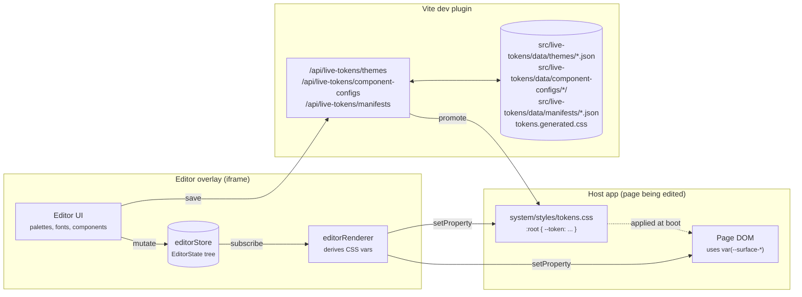

# Overview

## What this is

Live Tokens is a design-token editor plus a runtime that drives CSS
custom properties from that editor. A designer-developer opens the host
app, pops the editor overlay, and edits colours, typography, spacing,
radii, shadows, motion, and per-component slots. The page repaints on
every change. No reload required. The editor runs in an iframe layered
over the page, so editing happens in context: the user sees the real
app, not a sandbox.

When the user is satisfied, they **promote** a saved theme to production.
That writes the theme's variables into
`src/system/styles/tokens.generated.css` (sibling of the
developer-authored `tokens.css`) and regenerates `fonts.css` from the
resolved font registry. Production builds bundle those CSS files
unchanged. The production bundle ships no editor code, no JSON loader,
no runtime indirection.

## Shipping modes

The package supports two consumption shapes from a single source tree:

```
@motion-proto/live-tokens
├── starter mode: the repo itself, cloned as a degit template
└── library mode: npm-installed into an existing Svelte 5 + Vite app
```

**Starter.** `npx degit motionproto/live-tokens my-app`. The repo is a
working app; `src/app/Home.svelte` is the only file you replace.

**Library.** Install, register the Vite plugin, call `configureEditor`,
mount `<LiveEditorOverlay />` and the `/editor` route. The library
exports its surface through `src/editor/index.ts` (overlay, stores,
theme service, font helpers, plugin entry).

The two modes differ only in `src/app/main.ts`, `src/app/App.svelte`,
and `src/app/Home.svelte`. Everything under `src/editor/` and
`src/system/` ships in both.

## What problem this solves

Most token systems force a choice:

- **Edit in Figma.** Rich tooling, but the values you ship come from an
  export pipeline separate from the running app. Your team cannot see
  what the design looks like under real CSS, real fonts, real responsive
  breakpoints, or real component states.
- **Edit in code.** Ship-accurate, but every iteration means editing CSS
  files, saving, waiting for the build, re-checking the page. Loop time
  runs five to ten seconds per change, which kills exploratory work.

Live Tokens splits the difference. The editor lives next to the running
app and writes the same CSS variables the app reads. Iteration is
real-time, the artefact is plain CSS, and production never imports the
editor.

## System overview



Three takeaways:

1. **The runtime artefact is `:root` CSS variables.** Everything else
   sits upstream of that. Palettes derive into vars, theme files merge
   into vars, component aliases emit `var(...)` references that resolve
   to vars.
2. **The editor iframe writes to both its own document and the
   parent's.** That is how an editor running in an overlay can repaint
   the surrounding host page in real time, without postMessage plumbing.
   See `cssVarSync.ts` and chapter 07.
3. **The dev-server plugin (`themeFileApi`) turns "save" into a JSON
   file on disk.** Production builds never run the plugin and never
   need it. By build time, the chosen theme has been baked into
   `tokens.generated.css` (a sibling of the developer-authored
   `tokens.css`, which the plugin never writes).

## Where to go next

The user manual chapters cover the consumer-facing workflow:

- **[Getting started](getting-started.md)**: install, run, first edit.
- **[Editing tokens](editing-tokens.md)**: tour the editor's tabs.
- **[Themes workflow](themes-workflow.md)**: save, switch, promote.
- **[Creating components](creating-components.md)**: the Claude skill walks
  you through making your own component editable.
- **[Token naming](token-naming.md)**: the naming pattern.

The reference chapters (architecture, state, dev-server plugin,
overlay, component-system internals, conventions) are the appendix
material. Read them when you are extending the package itself, not
when you are using it.
