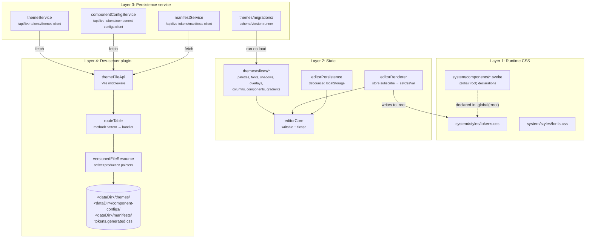
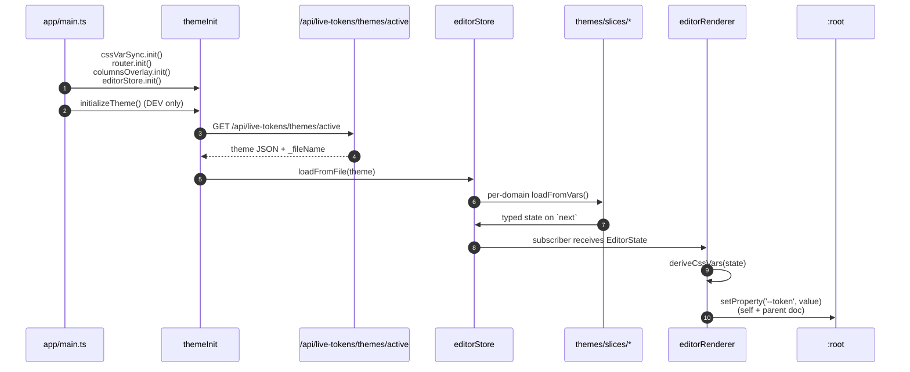
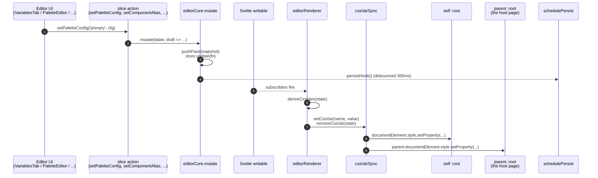
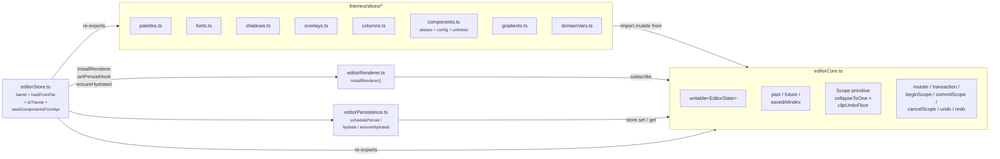
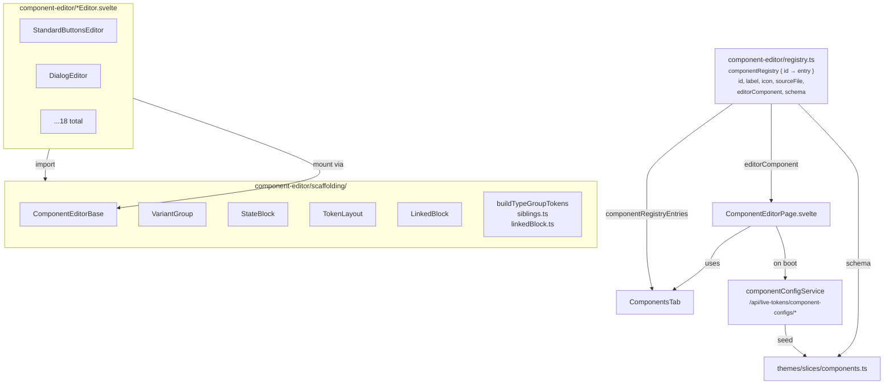
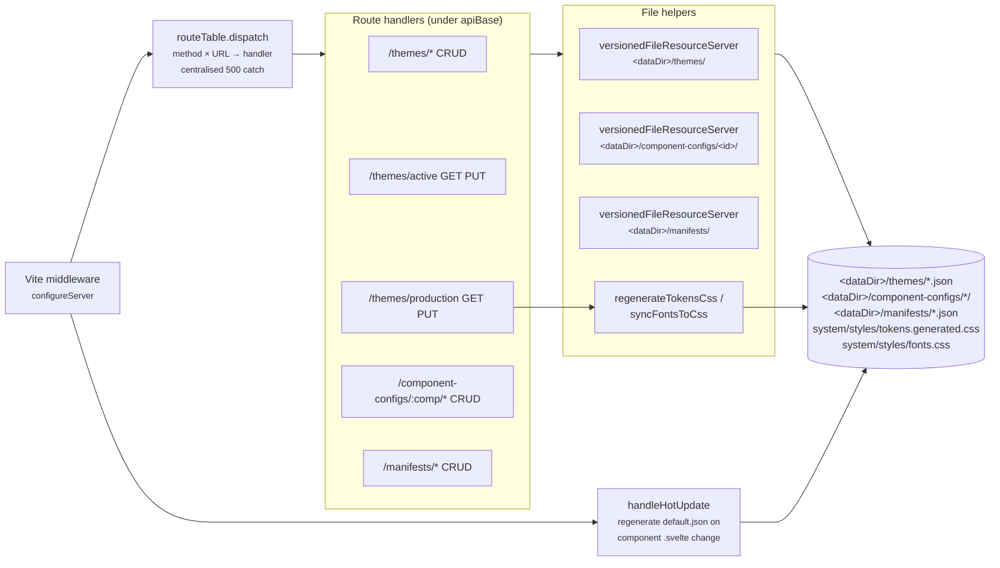

# Architecture

## Layers

The system divides into four layers. Each owns its concerns;
dependencies flow downward.



### Layer 1: Runtime CSS (`src/system/`)

This is what production ships. `tokens.css` declares every theme token
in `:root`. `fonts.css` carries `@font-face` rules and the resolved
`--font-*` stack values. Components in `src/system/components/` use
`var(--token)` references and declare their own slot variables in a
`:global(:root)` block inside their `<style>`. Those slot variables are
the **component tokens** the alias editor lets users re-assign.

Production imports `tokens.css` and ships the CSS unchanged. No JS state
involved.

### Layer 2: Editor state (`src/editor/core/store/`, `src/editor/core/themes/slices/`)

In-memory editor state. The single funnel is the `EditorState` tree
(`editorTypes.ts`). Writes go through `mutate()` (or `transaction()` or
scopes); the renderer subscribes and writes derived CSS variables to
`:root` via `cssVarSync`. Persistence is debounced localStorage. Detail
in chapter 03.

### Layer 3: Persistence service (`src/editor/core/themes/`, `components/`, `manifests/`)

Client-side wrappers that talk to the dev-server plugin's
`/api/live-tokens/*` routes. All three services wrap a generic
`versionedFileResource(baseUrl)` (in
`src/editor/core/storage/files/versionedFileResourceClient.ts`) so the
list/load/save/delete plus active/production vocabulary stays identical
across each. Migrations run on load. Theme files and component-config
files each carry a `schemaVersion` stamp; the runner applies any
registered migrations whose `fromVersion >= file.schemaVersion`. Detail
in chapter 04.

### Layer 4: Dev-server plugin (`vite-plugin/`)

A Vite plugin (`themeFileApi`) that mounts under `/api/live-tokens/*`
(default; the `apiBase` is configurable). Every endpoint is a handler
in a route table; the dispatcher (`routeTable.ts`) does the URL and
method match and centralises the 500-on-throw catch. The plugin also
seeds default files on first start, auto-injects `__PROJECT_ROOT__`,
`__APP_VERSION__`, and `__LIVE_TOKENS_API_BASE__` Vite defines, and on
hot-update of a `src/system/components/*.svelte` file it regenerates
that component's `default.json`. Detail in chapter 06.

## Data flow: read path

When a user opens the app, the chain that paints the page:



In production, step 2 is skipped. `tokens.css` and
`tokens.generated.css` already sit on disk with the production-promoted
values, so the page renders correctly without any `/api/live-tokens`
call.

## Data flow: write path

When the user moves a slider in the editor:



Two non-obvious points:

1. **The renderer diffs.** It tracks the last-applied map and writes
   only the keys whose values changed, then removes the keys that
   disappeared. Without this, every drag would set roughly 200
   properties per frame.
2. **`cssVarSync` writes to both the self document and the parent.**
   When the editor sits in the iframe, the parent is the host app, so
   slider drags repaint the actual page. When the editor runs
   standalone (no iframe), the parent root resolves to null and writes
   go to one document only.

## Module map (state)



Rules the diagram encodes:

- **Slices import `mutate` from `editorCore`, not from the barrel.**
  This keeps the slice → core dependency one-way and avoids a
  circular import.
- **The barrel (`editorStore.ts`) is the only file that touches both
  core and every slice.** It owns boot wiring (`setPersistHook`,
  `ensureHydrated`, `installRenderer`) and the load/save orchestration
  that crosses every slice (`loadFromFile`, `toTheme`,
  `seedComponentsFromApi`).
- **The renderer is the only DOM consumer.** Slices never write to
  `:root`. If a slice needs to derive CSS, it exports an
  `xxxToVars(state)` pure function that the renderer calls.

## Module map (component editor)



The registry is the single source of truth for first-party components.
Adding a first-party component means authoring its runtime and editor,
then adding one entry. Consumer projects register at runtime through
`registerComponent()`; see chapter 05. Nav-rail order is alphabetical
by label.

## Module map (dev-server plugin)



`versionedFileResource` is parameterised; the themes resource,
per-component resources, and the manifests resource all share the same
active/production vocabulary. See chapter 06.

## Boot orchestration

`src/app/main.ts` is the single boot orchestration point. Its job is
to call each module's idempotent `init()` once before the Svelte app
mounts:

```ts
async function boot() {
  cssVarSync.init();      // resolves self + parent document roots
  router.init();          // seeds route store from window.location, wires popstate
  columnsOverlay.init();  // subscribe-then-persist for the columns toggle
  editorStore.init();     // ensures hydrate has run

  if (import.meta.env.DEV) {
    await initializeTheme();   // GET /api/live-tokens/themes/active, loadFromFile
  }
  mount(App, { target: document.getElementById('app')! });
}
```

Modules expose idempotent `init()` calls so library consumers can wire
boot in any order. Library consumers replicate this orchestration
inside their own `main.ts`; see README "Use as a library".

## Cross-cutting contracts

These contracts span layers and are the parts most likely to surprise
you:

- **CSS-var fan-out.** `cssVarSync` writes to both the editor's iframe
  document and the parent's. Anything touching `:root` style must go
  through `cssVarSync` or the editor stops repainting the host page
  (chapter 07).
- **State model.** Components have *component states* (default,
  selected, disabled; mutually exclusive) and *interaction states*
  (default, hover; in selects). Disabled is terminal;
  selected-disabled is impossible. *Parts* (Dialog overlay, header,
  body, footer; Tooltip arrow) are not states (chapter 10).
- **Linking is dev-declared.** `canBeLinked` and `groupKey` live in
  the editor's token list, registered via `registerComponentSchema`.
  Users toggle whether siblings are *currently* linked, but they do
  not define what *can* be linked (chapter 05).
- **Theme files and component-config files have independent schema
  versions.** Adding a theme migration steps the theme version;
  component-config migrations step the component-config version. They
  never share a version axis (chapter 04).
- **Themes and components are orthogonal.** `loadFromFile` (loading a
  theme) preserves `state.components`. Component slices live in their
  own files under `<dataDir>/component-configs/<id>/` (chapter 04).
