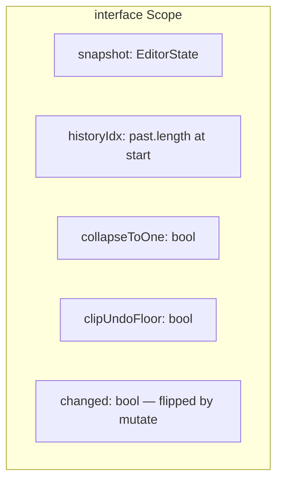
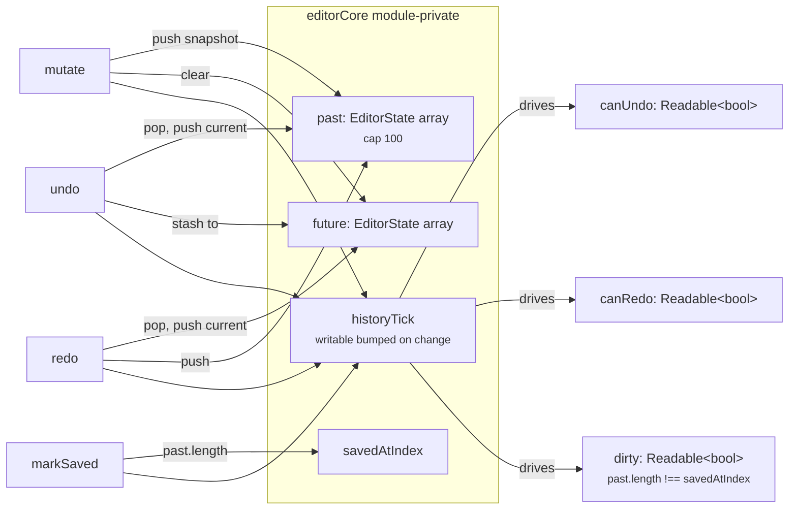
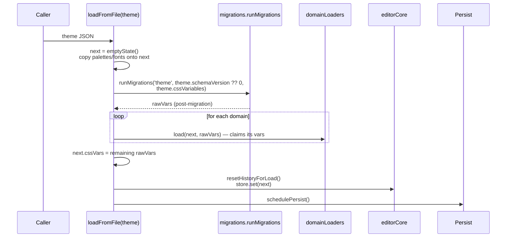

# State, history, and persistence

Everything the editor mutates lives in one tree, threaded through one funnel. This
chapter is the rules of the road for the state core.

## The state tree

`EditorState` (`src/lib/editorTypes.ts`) is the single canonical shape. View state
(tab selection, dialog flags, drag payloads, in-progress draft hex values) is *not*
in the tree — only what a save needs to round-trip:

```ts
interface EditorState {
  palettes: Record<string, PaletteConfig>;
  fonts: { sources: FontSource[]; stacks: FontStack[] };
  shadows: { globals: ShadowGlobals; tokens: ShadowToken[];
             overrides: Record<string, ShadowOverrideFlags> };
  overlays: { tokens: OverlayToken[]; hoverTokens: OverlayToken[]; globals: OverlayGlobals };
  columns: ColumnsState;
  components: Record<string, ComponentSlice>;   // per-component aliases + config
  gradients: { tokens: GradientToken[] };
  cssVars: Record<string, string>;              // catch-all for vars not yet in a typed slice
}
```

Each top-level domain has its own slice file under `src/lib/slices/`:

| Domain | Slice | Owns |
|---|---|---|
| `palettes` | `slices/palettes.ts` | Palette config setters; seeded from theme |
| `fonts` | `slices/fonts.ts` | Sources + stacks; seeded from theme |
| `shadows` | `slices/shadows.ts` | Tokens, overrides, global drivers, parser |
| `overlays` | `slices/overlays.ts` | Overlay/hover token lists + globals |
| `columns` | `slices/columns.ts` | Page-grid columns count/gutter/margin/maxWidth |
| `components` | `slices/components.ts` | Per-component `{aliases, config, unlinked}` + sibling sharing |
| `gradients` | `slices/gradients.ts` | Fixed-slot gradient tokens |
| `cssVars` | (no slice) | Catch-all string→string bag for unmigrated tokens |

Each slice exports:

- A **default factory** (where applicable) used by `editorStore.emptyState()`.
- An **`xToVars(state)` pure function** consumed by `editorRenderer.deriveCssVars()`.
- An **`xEqualsDefault(state)` predicate** consumed by `toTheme` so unchanged domains
  don't bloat the saved theme JSON.
- A **`loadXFromVars(next, rawVars)` loader** consumed by `loadFromFile`'s
  `domainLoaders` table — the loader claims its variables from the raw bag and
  routes them into typed state.
- **Action functions** (e.g., `setPaletteConfig`, `setComponentAlias`) that wrap a
  `mutate(label, draft => …)` call.

That five-bullet contract is what makes adding a domain mechanical: implement those
functions, register the loader in `editorStore.domainLoaders`, and wire the renderer
call.

## The mutation funnel

Every change goes through `editorCore.mutate(label, fn)` (`src/lib/editorCore.ts:259`):

```ts
mutate('set palette primary.baseColor', (draft) => {
  draft.palettes.primary.baseColor = '#ff0000';
});
```

`mutate` is the single chokepoint:

1. Snapshot the current state via `structuredClone`.
2. Push the snapshot onto `past[]` (capped at `HISTORY_MAX = 100`; clear `future[]`).
3. `store.update(s => { fn(s); return s; })` — apply the mutation in place; Svelte
   subscribers fire.
4. Bump the history tick so derived stores (`canUndo`, `canRedo`, `dirty`) re-evaluate.
5. Schedule a debounced persist (`schedulePersist`, 300 ms).

Direct `store.set()` is reserved for "open a different document" semantics
(`loadFromFile`, `seedComponentsFromApi`) where history is reset, not pushed.

## Scopes — the unified history primitive

Until Wave 7, the codebase had three separate history regimes (`mutate`, `transaction`,
palette session). Wave 7 collapsed them into one **`Scope`** primitive with two
orthogonal axes:



The two axes:

| Axis | When false | When true |
|---|---|---|
| **`collapseToOne`** | Each `mutate` inside the scope is its own history entry. | On commit, intra-scope `past[]` entries collapse to one (the pre-scope snapshot). |
| **`clipUndoFloor`** | Undo can walk past the scope's start. | Undo is clipped to `historyIdx`; on commit, intra-scope past entries are dropped. |

Mapping to use cases:

- **Unscoped one-shot** — plain `mutate(label, fn)`. Each call is one entry.
- **Drag gesture / atomic edit** — `scope { collapseToOne: true, clipUndoFloor: false }`.
  Slider drags fire dozens of `mutate` calls; one commit at pointerup collapses them
  to a single undoable entry.
- **Palette panel session** — `scope { collapseToOne: true, clipUndoFloor: true }`.
  While the panel is open, undo can't escape it (so the user doesn't accidentally
  walk back past the work they're examining); on cancel/commit, the whole session
  reduces to one entry (or is reverted entirely).

The wrapper helpers in `editorCore.ts`:

| Helper | Form | Equivalent scope |
|---|---|---|
| `mutate(label, fn)` | unscoped | — |
| `transaction(label, fn)` | sync closure | `{collapseToOne: true, clipUndoFloor: false}` |
| `beginSliderGesture(label)` | window-pointerup wiring | `{collapseToOne: true, clipUndoFloor: false}` |
| `beginScope({label, collapseToOne, clipUndoFloor})` + `commitScope`/`cancelScope` | explicit handle | any combination |

The handle-based form is the only one palette panels need (they open on mount, close
on user action — no closure form fits). UI sliders are the only consumer of
`beginSliderGesture`.

### Cancel — silent vs not

`cancelScope(scope, { silent })` always reverts state to the snapshot and drops
intra-scope past entries. The `silent` flag controls whether the cancel surfaces:

- `silent: false` (default) — used when the user explicitly aborts (clicking
  the palette panel close button). Bumps the history tick, fires `persistHook`. The
  UI sees `dirty` flip to match the post-revert position.
- `silent: true` — used by internal auto-aborts (a stray transaction killed by
  `undo()`, a competing scope opening). State reverts but no tick fires and no
  persist runs. `dirty` reflects the pre-scope position.

This distinction matters because `cancelScope` runs in two very different contexts —
user intent vs. internal cleanup — and wiring both through the same path with the
same UI side effects would surface ghost dirty signals.

## History stacks

`editorCore.ts` maintains three pieces of history state, all module-private:

```ts
const past: EditorState[] = [];      // capped at HISTORY_MAX = 100
const future: EditorState[] = [];    // cleared on any new mutate
let savedAtIndex = 0;                // markSaved() sets this to past.length
```

The history arrays live **outside Svelte reactivity** — `derived` stores read the
`historyTick` writable instead. This is so `mutate` can apply changes in-place to
the live state (`store.update(s => { fn(s); return s; })`) without Svelte serializing
or copying it through the writable's set path. History snapshots are independent —
each is a `structuredClone` taken at push time, so in-place mutation of the live
state can't corrupt history.



`undo()` and `redo()` cancel any open *transaction* (non-clipping) scope silently
before walking history, but respect the clipping scope's floor (`past.length <=
floor` short-circuits). This is what makes "open palette panel, drag a slider, undo"
behave intuitively — undo walks back the slider drag, then stops at the panel-open
floor.

## Persistence

Persistence is **debounced localStorage** (`src/lib/editorPersistence.ts`):

- Every `mutate` / `undo` / `redo` calls `persistHook` (wired to `schedulePersist`).
- `schedulePersist` debounces to a 300 ms timer; when the timer fires,
  `persistNow` writes the full state JSON to `storageKey('editor-state')`.
- `quietSet` swallows quota / serialization errors — persistence is best-effort.

The storage key is resolved **lazily** (`getPersistKey()` is called on every save,
not memoized). Library consumers calling `configureEditor({storagePrefix: 'my-app-'})`
*after* `editorPersistence` was imported still get the configured prefix on the
first write. (This was the M8 audit fix.)

### Hydrate

`hydrate()` runs eagerly from the editor-store barrel (`ensureHydrated()` at module
load, gated by a flag so it fires once). The reason it's eager: Svelte mounts
children before parents, and child components reading `$editorState` in `onMount`
need to see persisted state, not the transient empty default.

Hydrate also schedules `seedShadowsFromDom()` via `requestAnimationFrame`. Shadows
were the only domain that wasn't fully captured in JSON-serialized state on a
fresh install; the rAF defer waits for `tokens.css` to apply before
`getComputedStyle` reads the baseline.

## "Open a different document" — `loadFromFile`

Loading a theme isn't just a `mutate` — it replaces state and resets history:



Why history is reset and not pushed: undo crossing a theme load is incoherent — the
user opened a different document. A "go back to the prior theme" affordance would
be its own command (re-load the prior file by name), not undo.

`state.components` is *preserved* across theme loads. Component slices live in their
own files; `loadComponentsFromVars` clones the current `components` onto `next` and
strips any component-owned vars that may have leaked into the theme bag.

## Test coverage

The state core's contract lives in tests. Three test files are the canonical
regression net for any state work:

| File | Lines | Covers |
|---|---|---|
| `src/lib/editorStore.test.ts` | 332 | All three (now-folded) history regimes; cross-regime edges (e.g. "undo with pending transaction aborts it first") |
| `src/lib/componentConfig.test.ts` | 105 | Per-component dirty tracking; seed-from-API; config baseline |
| `src/lib/migrations/migrations.test.ts` | 108 | Legacy → current; gating by stamp; identity at current; purity |
| `src/lib/lazyConfig.test.ts` | — | `configureEditor` storage-prefix observed lazily |

If you touch `editorCore.ts`, `editorStore.ts`, or any slice's history-affecting
behavior, run `npm run test` and expect these to stay green.

## Test-only escape hatches

Three test-only resets exist; they're not on the public barrel:

- `__resetForTests()` (in `editorStore.ts`) — full reset (core + renderer + components).
- `__resetCoreForTests()` (in `editorCore.ts`) — just core.
- `__resetComponentsForTests()` (in `slices/components.ts`) — just per-component baseline.

These reach into module-private mutables on purpose. Don't depend on them from
production code.

## Summary

- One state tree (`EditorState`), one mutation funnel (`mutate`), one history machine
  (the `Scope` primitive in `editorCore`).
- Slices own their domain's defaults, derivation, and load contract; the renderer is
  the only DOM consumer.
- Persistence is debounced localStorage, resolved against the lazy storage prefix.
- Theme loads reset history; component slices are orthogonal to themes and survive.
