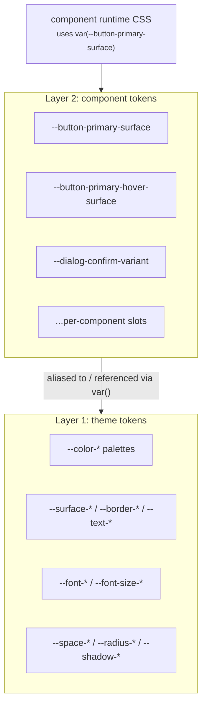
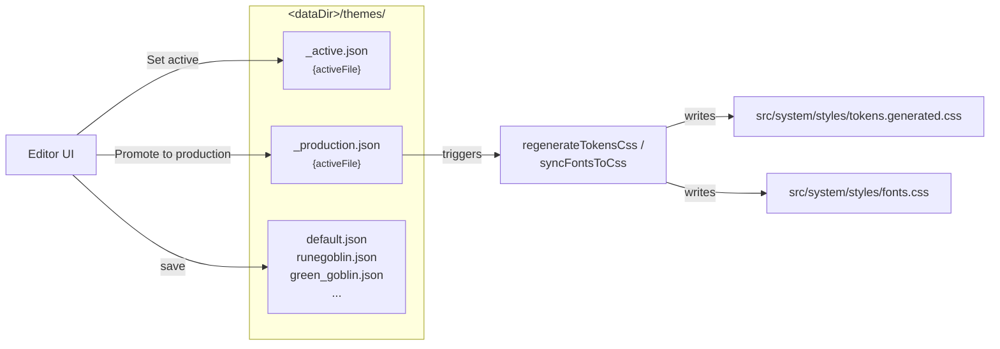
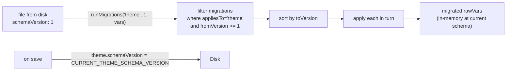

# Tokens, themes, and migrations

This chapter covers what tokens are, how `tokens.css` serves as the
production runtime, what theme JSON files persist, and how schema
migrations work.

For naming rules (categories, suffix meanings, when to use `thickness`
vs `width`, and so on) read `src/system/styles/CONVENTIONS.md`. This
document covers architecture only.

## Two layers of tokens

Live Tokens uses a two-layer vocabulary:



**Layer 1: theme tokens** are the design system's vocabulary: palettes,
surfaces, borders, text colours, type scales, spacing scales, radii,
shadows, motion. They live in `src/system/styles/tokens.css` and get
recoloured or rescaled by themes.

**Layer 2: component tokens** are per-component slots. Each component
declares its slots in its `<style>` block under `:global(:root)` and
references theme tokens through them. The editor's alias map records
which theme token each slot currently points at:

```jsonc
// <dataDir>/component-configs/button/default_01.json
{
  "aliases": {
    "--button-primary-surface": "--surface-primary",
    "--button-primary-hover-surface": "--surface-primary-higher",
    "--button-primary-radius": "--radius-4xl"
  },
  "config": { "--button-shimmer": "--shimmer-off" }
}
```

The `aliases` map is "component-token name → CSS var ref" (theme
token name). At runtime the renderer emits
`--button-primary-surface: var(--surface-primary);`.

## tokens.css: the production runtime

`src/system/styles/tokens.css` is the single CSS file bundled into
production. It declares every theme token in `:root` with a sensible
default value:

```css
:root {
  --color-neutral-100: #ece3dd;
  --color-neutral-200: #d3cac4;
  /* ... 11 ramps × 11 steps ... */
  --surface-primary: var(--color-primary-500);
  --text-primary: var(--color-neutral-100);
  --radius-sm: 4px;
  --space-8: 8px;
  /* ... */
}
```

In dev, the editor overlays runtime values onto `:root` via
`cssVarSync`. `tokens.css`'s defaults remain the cascade root, but
inline `style="--token: ..."` on `<html>` wins. When the user
**promotes** a theme to production, the dev plugin regenerates
`tokens.generated.css`. This sidecar sits next to `tokens.css`; the
package imports it immediately after, with `:root:root` selectors so
its overrides win. The developer-authored `tokens.css` is never
written by the plugin.

The generated CSS file is therefore a snapshot of the most recently
promoted theme. The editor never has to be loaded for production to
work, and CI builds just bundle the file.

## Component runtime declarations

Components in `src/system/components/*.svelte` declare their own slot
variables in a `:global(:root)` block inside their `<style>`:

```svelte
<style>
  :global(:root) {
    --button-primary-surface: var(--surface-primary);
    --button-primary-text: var(--text-primary);
    --button-primary-radius: var(--radius-4xl);
    /* ... */
  }

  .button.primary {
    background: var(--button-primary-surface);
    color: var(--button-primary-text);
    border-radius: var(--button-primary-radius);
  }
</style>
```

`extractGlobalRootBody`
(`src/editor/core/themes/parsers/globalRootBlock.ts`) parses the
`:global(:root)` block. Both the dev-server plugin (when seeding
`default.json`) and the in-browser registry (when picking up the
source-of-truth list) read it.

One quirk worth knowing: **the parser does not pre-compile SCSS**. If
you write `@each $variant in (info, warning) { ... --notification-#{$variant}-surface: ...; }`,
the parser sees the literal `@each` text and finds zero token
declarations. `Notification.svelte`'s SCSS rules use `@each` to
compress the per-variant styles, but the `:global(:root)` block stays
flat by design. An inline comment in `Notification.svelte` documents
this.

## Theme files

Themes live as JSON files under the plugin's data directory. By
default that is `src/live-tokens/data/themes/`, configurable via
`live-tokens.config.json` or `themeFileApi({ dataDir: '...' })`.
Throughout this chapter `<dataDir>` is shorthand for that resolved
path. Each theme file is a complete saved palette set plus everything
else the user has tweaked: column grid, overlay tints, font registry,
shadow drivers, plus the catch-all `cssVariables` bag for tokens not
yet in a typed slice.

```jsonc
// <dataDir>/themes/runegoblin-teal.json (excerpt)
{
  "name": "RuneGoblin Teal",
  "createdAt": "2026-04-18T01:42:00.000Z",
  "updatedAt": "2026-05-04T14:12:00.000Z",
  "schemaVersion": 1,
  "editorConfigs": {
    "primary": { "baseColor": "#1f7a8c", /* curve config */ },
    /* ...one entry per palette in PALETTE_SPECS... */
  },
  "cssVariables": {
    "--surface-primary": "var(--color-primary-500)",
    "--columns-count": "12",
    /* ...everything not in a typed slice... */
  },
  "fontSources": [ /* google/typekit/css-url/font-face entries */ ],
  "fontStacks":  [ /* per-variable font cascades */ ]
}
```

### Lifecycle: active, production

The `<dataDir>/themes/` directory has two meta-files alongside the
saved themes:

| File | Role |
|---|---|
| `_active.json` | `{ activeFile: "<name>" }`. The theme loaded at dev-server boot. |
| `_production.json` | `{ activeFile: "<name>" }`. The theme synced to `tokens.generated.css` on promote. |

The vocabulary (list, load, save, delete, plus active and production
pointers) is implemented once in
`vite-plugin/files/versionedFileResourceServer.ts` (server) and
`src/editor/core/storage/files/versionedFileResourceClient.ts`
(client). The same vocabulary is used by component-config files (one
resource per component directory under
`<dataDir>/component-configs/<id>/`) and by manifest files under
`<dataDir>/manifests/`.



A save on the *production* theme also re-runs the sync. There is no
separate "promote again" step. That keeps editing the production
theme WYSIWYG: the file you would ship if you built right now stays
in lockstep with what the editor shows.

## Component-config files

Each component has its own directory under
`<dataDir>/component-configs/<id>/`:

```
<dataDir>/component-configs/button/
├── _active.json            { "activeFile": "default_01" }
├── _production.json        { "activeFile": "default" }
├── default.json            (regenerated from src/system/components/Button.svelte on hot-update)
└── default_01.json         (user-saved)
```

`default.json` regenerates on every hot-update of the component's
Svelte file (`themeFileApi.handleHotUpdate`). It is the seed:
identity-mapped aliases parsed from the component's `:global(:root)`
block. User saves never overwrite `default.json` (the API rejects PUT
and DELETE for `name === 'default'`); they go to other names like
`default_01.json`, `_my_brand.json`, and so on.

The shape on disk:

```ts
interface ComponentConfig {
  name: string;
  component: string;     // matches the registry id
  createdAt: string;
  updatedAt: string;
  aliases: Record<string, string>;       // CSS-var name → theme alias OR literal value
  config?: Record<string, unknown>;       // literal-valued knobs
  schemaVersion?: number;                 // absent = 0; loader migrates up
  _fileName?: string;                     // server-attached, optional
}
```

The aliases map on disk is a flat string→string. In memory it splits
in two:

- Entries whose key is in `KNOWN_COMPONENT_CONFIG_KEYS`
  (`src/editor/core/components/componentConfigKeys.ts`) route to the
  `config` bucket as literal values.
- Everything else becomes a `CssVarRef` discriminated union:
  `{kind:'token', name}` if the value starts with `--`, otherwise
  `{kind:'literal', value}`.

The renderer dispatches on the `kind`: tokens emit `var(<name>)`,
literals emit the raw value.

## Manifests (preset bundles)

A **manifest** pins one theme file plus one config file per component
into a single named bundle. Manifests live in
`<dataDir>/manifests/*.json` and use the same active/production
vocabulary as themes and component configs.

```jsonc
// <dataDir>/manifests/my-brand.json (excerpt)
{
  "name": "My Brand",
  "theme": "runegoblin-teal",
  "components": {
    "button": "default_01",
    "dialog": "default"
  }
}
```

Two slots exist: the protected `default` baseline and the single
`active` manifest. There is no "production" or "diverged" concept for
manifests; theme and per-component "Adopt" actions patch the active
manifest's refs server-side via `manifestService.applyManifest`.

`src/editor/core/manifests/manifestService.ts` is the client wrapper.
Applying a manifest is atomic on the server: it validates every
referenced file, flips the theme plus each component's `_active.json`
pointer, and returns the resolved theme and component configs in one
payload. Clients usually follow with a full page reload.

## Palette derivation

Palettes are special. They are not stored as flat token values; they
are stored as a *config* (base colour, curves, overrides) and
**derived** into tokens at render time.
`src/editor/core/palettes/paletteDerivation.ts` is the pure function:

```ts
const PALETTE_SPECS = [
  { label: 'Neutral',    cssNamespace: 'neutral',   mode: 'gray' },
  { label: 'Primary',    cssNamespace: 'primary',   mode: 'chromatic' },
  /* ... */
];

palettesToVars(state.palettes) → { '--color-primary-100': '#...',
                                    '--color-primary-200': '#...',
                                    /* 11 steps × 10 palettes = ~110 vars */ }
```

Derivation uses OKLCH (`src/editor/core/palettes/oklch.ts`) for
perceptual uniformity and a Bezier-based curve engine
(`src/editor/ui/curveEngine.ts`) for the lightness and saturation
falloff per ramp. The `PaletteEditor` UI renders the curves and
sliders; the *result* is what lives in state. `paletteDerivation`
runs both at boot (so the disabled-state preview reads correctly
without a PaletteEditor instance mounted) and inside the renderer
subscriber.

## Schema migrations

Theme files and component-config files both carry an optional
`schemaVersion` integer. The runner
(`src/editor/core/themes/migrations/index.ts`) applies any registered
migration whose `fromVersion >= file.schemaVersion`, in `toVersion`
order:



Two independent version sequences:

- **Theme migrations** step `CURRENT_THEME_SCHEMA_VERSION`.
- **Component-config migrations** step `CURRENT_COMPONENT_SCHEMA_VERSION`.

Both constants are *computed* from the registered migration list
(`countFor(kind)`), so adding a new dated file auto-bumps the
constant. There is no shared "both" kind; every migration declares
one or the other.

### Convention: dated files

Each migration is its own file under
`src/editor/core/themes/migrations/`, named
`YYYY-MM-DD-<short-name>.ts`:

```
themes/migrations/
├── index.ts                                              # runner + MIGRATIONS array
├── 2026-04-24-component-prefix-and-suffix-renames.ts
├── 2026-04-24-legacy-keys-and-bg-to-canvas.ts
├── 2026-04-27-segmentedcontrol-disabled-flatten.ts
├── 2026-05-08-collapsiblesection-frame-and-cleanup.ts
├── 2026-05-08-collapsiblesection-variant-namespace.ts
├── 2026-05-10-sectiondivider-gradient-stops.ts
├── 2026-05-13-primary-to-brand.ts
└── migrations.test.ts
```

A migration exports:

```ts
export interface Migration {
  id: string;                              // 'YYYY-MM-DD-<short-name>'
  fromVersion: number;
  toVersion: number;
  appliesTo: 'theme' | 'component-config';
  apply(rawVars: Record<string, string>, meta: MigrationMeta): Record<string, string>;
}
```

`apply` is a pure transform on the raw vars map: add, remove, or
rename keys. The `meta.component` field is set when `appliesTo ===
'component-config'` so component-specific migrations (like the
segmentedcontrol disabled flatten) can short-circuit on other
components.

### TTL: when to delete a migration

A migration's bookkeeping is dead code once every saved file on disk
has been re-saved past it. Concretely: once every saved theme or
config file has `schemaVersion >= migration.fromVersion + 1`, the
migration is unreachable and the file can be deleted. Production
teams running this on real artefacts can defer the deletion until
they are confident.

Because migrations are dated and isolated, the lifecycle is
mechanical: delete the file (and its import in `index.ts`), and
`CURRENT_*_SCHEMA_VERSION` adjusts itself.

## Save round-trip

Saving the active theme through the editor:

```mermaid
sequenceDiagram
    participant UI as ThemeFileManager
    participant Store as editorStore
    participant Svc as themeService
    participant Plugin as themeFileApi
    participant FS as &lt;dataDir&gt;/themes/

    UI->>Store: toTheme(state, {name})
    Store->>Store: stamp schemaVersion = CURRENT_THEME_SCHEMA_VERSION<br/>collect xToVars(domain) into cssVariables
    Store-->>UI: Theme JSON
    UI->>Svc: saveTheme(fileName, theme)
    Svc->>Plugin: PUT /api/live-tokens/themes/:name (body = theme)
    Plugin->>FS: writeFileSync(filePath, JSON)
    alt fileName === productionName
        Plugin->>Plugin: regenerateTokensCss + syncFontsToCss
    end
    Plugin-->>Svc: { ok, fileName }
    Svc-->>UI: void
    UI->>Store: markSaved()
    Store->>Store: savedAtIndex = past.length<br/>dirty → false
```

`toTheme` only writes domain vars when they diverge from defaults
(`columnsEqualsDefault`, `overlaysEqualsDefault`). Unchanged domains
stay out of the saved JSON, which keeps theme files small and
surfaces meaningful diffs in version control.

## Summary

- `tokens.css` (developer-authored) plus `tokens.generated.css`
  (editor-owned sibling) make up the production runtime. The dev
  plugin regenerates the sidecar on promote; it never writes
  `tokens.css`.
- Theme files (`<dataDir>/themes/*.json`) carry palettes, fonts,
  shadows, overlays, columns, plus a catch-all `cssVariables` bag.
  Themes and component slices are orthogonal.
- Component-config files
  (`<dataDir>/component-configs/<id>/*.json`) carry per-component
  aliases, literal-value config, and a `schemaVersion`. `default.json`
  regenerates from the Svelte source.
- Manifest files (`<dataDir>/manifests/*.json`) bundle a theme plus
  one config per component; the active manifest is the single live
  snapshot.
- All three file types use the same active / production vocabulary
  (`versionedFileResource`).
- Migrations are dated, isolated, and self-bumping. The runner gates
  by `fromVersion >= file.schemaVersion`, so resaved files skip past
  migrations.
