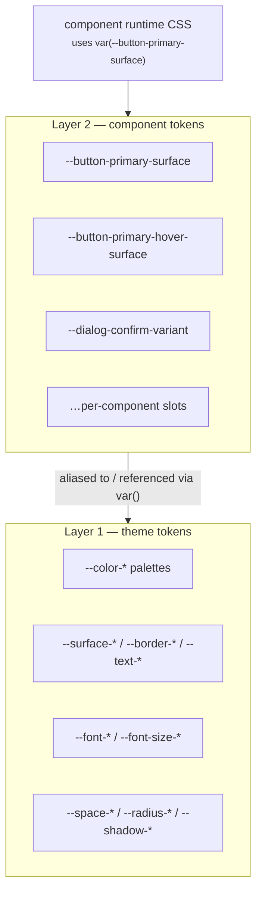
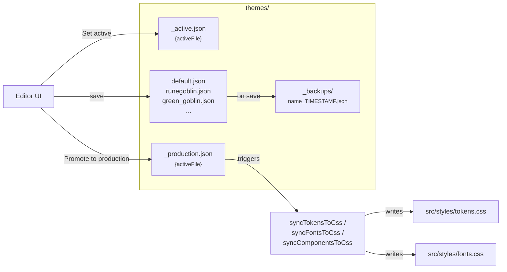
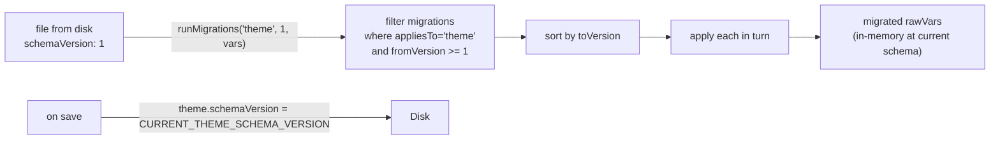
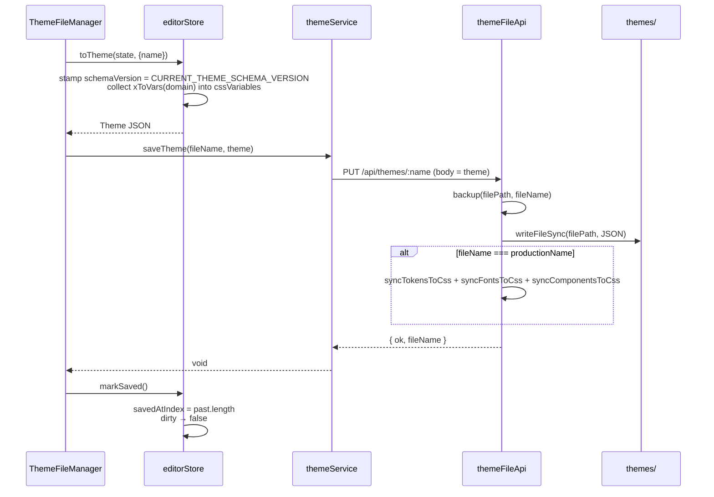

# Tokens, themes, and migrations

This chapter covers what tokens are, how `tokens.css` is the production runtime, what
gets persisted in theme JSON files, and how schema migrations work.

For naming rules — what categories exist, what suffixes mean, when to use `thickness`
vs `width`, etc. — read `src/styles/CONVENTIONS.md`. This document covers
*architecture* only.

## Two layers of tokens

Live Tokens uses a two-layer vocabulary:



**Layer 1 — theme tokens** are the design system's vocabulary: palettes, surfaces,
borders, text colors, type scales, spacing scales, radii, shadows, motion. They live in
`src/styles/tokens.css` and are recolored / re-scaled by themes.

**Layer 2 — component tokens** are per-component slots. Each component declares its
slots in its `<style>` block under `:global(:root)` and references theme tokens through
them. The editor's alias map records which theme token each slot is currently assigned
to:

```jsonc
// component-configs/button/default_01.json
{
  "aliases": {
    "--button-primary-surface": "--surface-primary",
    "--button-primary-hover-surface": "--surface-primary-higher",
    "--button-primary-radius": "--radius-4xl"
  },
  "config": { "--button-shimmer": "--shimmer-off" }
}
```

The `aliases` map is "component-token name → CSS var ref" (theme token name). At
runtime the renderer emits `--button-primary-surface: var(--surface-primary);`.

## tokens.css — the production runtime

`src/styles/tokens.css` is the single CSS file that's bundled into production. It
declares every theme token in `:root` with a sensible default value:

```css
:root {
  --color-neutral-100: #ece3dd;
  --color-neutral-200: #d3cac4;
  /* … 11 ramps × 11 steps … */
  --surface-primary: var(--color-primary-500);
  --text-primary: var(--color-neutral-100);
  --radius-sm: 4px;
  --space-8: 8px;
  /* … */
}
```

In dev, the editor overlays runtime values onto `:root` via `cssVarSync` —
`tokens.css`'s defaults are still the cascade root, but inline `style="--token: …"`
on `<html>` wins. When the user **promotes** a theme to production, the dev plugin
rewrites `tokens.css` itself: every `--name: value;` line that the theme overrides is
replaced in place, and additions land in a `/* Token additions */` block before the
closing brace.

So at any moment the production CSS file is a snapshot of the most recently promoted
theme — the editor never has to be loaded for production to work, and CI builds just
bundle the file.

## Component runtime declarations

Components in `src/components/*.svelte` declare their own slot variables in a
`:global(:root)` block inside their `<style>`:

```svelte
<style>
  :global(:root) {
    --button-primary-surface: var(--surface-primary);
    --button-primary-text: var(--text-primary);
    --button-primary-radius: var(--radius-4xl);
    /* … */
  }

  .button.primary {
    background: var(--button-primary-surface);
    color: var(--button-primary-text);
    border-radius: var(--button-primary-radius);
  }
</style>
```

The `:global(:root)` block is parsed by `extractGlobalRootBody`
(`src/lib/parsers/globalRootBlock.ts`) — both the dev-server plugin (when seeding
`default.json`) and the in-browser registry (when picking up the source-of-truth list)
read this block.

There is one quirk worth knowing: **the parser does not pre-compile SCSS**. If you
write `@each $variant in (info, warning) { … --notification-#{$variant}-surface: …; }`,
the parser sees the literal `@each` text and finds zero token declarations. The
`Notification.svelte` SCSS rules use `@each` to compress the per-variant styles, but
the `:global(:root)` block is kept flat by design. There's an inline comment in
`Notification.svelte` documenting this.

## Theme files

Themes live as JSON files in `themes/`. Each represents a complete saved palette set
plus everything else the user has tweaked (column grid, overlay tints, font registry,
shadow drivers, plus the catch-all `cssVariables` bag for tokens not yet in a typed
slice).

```jsonc
// themes/runegoblin-teal.json (excerpt)
{
  "name": "RuneGoblin Teal",
  "createdAt": "2026-04-18T01:42:00.000Z",
  "updatedAt": "2026-05-04T14:12:00.000Z",
  "schemaVersion": 1,
  "editorConfigs": {
    "primary": { "baseColor": "#1f7a8c", /* curve config */ },
    /* …one entry per palette in PALETTE_SPECS… */
  },
  "cssVariables": {
    "--surface-primary": "var(--color-primary-500)",
    "--columns-count": "12",
    /* …everything not in a typed slice… */
  },
  "fontSources": [ /* google/typekit/css-url/font-face entries */ ],
  "fontStacks":  [ /* per-variable font cascades */ ]
}
```

### Lifecycle: active, production, backups

Each `themes/` directory has three meta-files alongside the saved themes:

| File | Role |
|---|---|
| `_active.json` | `{ activeFile: "<name>" }` — the theme loaded at dev-server boot. |
| `_production.json` | `{ activeFile: "<name>" }` — the theme synced to `tokens.css` on promote. |
| `_backups/<name>_<timestamp>.json` | Per-save backup; `BACKUP_RETENTION = 10` per name. |

The vocabulary — list / load / save / delete + active / production + backups — is
implemented once in `src/vite-plugin/files/versionedFileResource.ts` (server) and
`src/lib/files/versionedFileResource.ts` (client). The same vocabulary is used by
component-config files (one resource per component directory under
`component-configs/<id>/`).



A save on the *production* theme also re-runs the sync — there's no separate "promote
again" step. This is so editing the production theme via the editor stays
WYSIWYG: the file you'd ship if you built right now is in lockstep with what the
editor is showing.

## Component-config files

Each component has its own directory under `component-configs/<id>/`:

```
component-configs/button/
├── _active.json            { "activeFile": "default_01" }
├── _production.json        { "activeFile": "default" }
├── default.json            (regenerated from src/components/Button.svelte on hot-update)
├── default_01.json         (user-saved)
└── _backups/
    └── default_01_2026-05-03T23-52-10-415Z.json
```

`default.json` is regenerated on every hot-update of the component's Svelte file
(`themeFileApi.handleHotUpdate`). It's the seed: identity-mapped aliases parsed out
of the component's `:global(:root)` block. User saves never overwrite `default.json`
(the API rejects PUT/DELETE for `name === 'default'`); they go to other names like
`default_01.json`, `_my_brand.json`, etc.

The shape on disk:

```ts
interface ComponentConfig {
  name: string;
  component: string;     // matches the registry id
  createdAt: string;
  updatedAt: string;
  aliases: Record<string, string>;       // CSS-var name → theme alias OR literal value
  config?: Record<string, unknown>;       // literal-valued knobs
  schemaVersion?: number;                 // absent = 0; loader migrates up
  _fileName?: string;                     // server-attached, optional
}
```

The aliases map on disk is a flat string→string. In memory it's split:

- Entries whose key is in `KNOWN_COMPONENT_CONFIG_KEYS` (`src/lib/componentConfigKeys.ts`)
  are routed to the `config` bucket as literal values.
- Everything else becomes a `CssVarRef` discriminated union — `{kind:'token', name}`
  if the value starts with `--`, otherwise `{kind:'literal', value}`.

The renderer dispatches on the `kind`: tokens emit `var(<name>)`, literals emit the
raw value. This split was the C3 audit fix; before it, the alias map was a stringly-
typed bucket carrying both, and `--dialog-confirm-variant: primary;` ended up in CSS
as junk that nothing read.

## Palette derivation

Palettes are special: they're not stored as flat token values, they're stored as a
*config* (base color + curves + overrides) and **derived** into tokens at render time.
`src/lib/paletteDerivation.ts` is the pure function:

```ts
const PALETTE_SPECS = [
  { label: 'Neutral',    cssNamespace: 'neutral',   mode: 'gray' },
  { label: 'Primary',    cssNamespace: 'primary',   mode: 'chromatic' },
  /* … */
];

palettesToVars(state.palettes) → { '--color-primary-100': '#…',
                                    '--color-primary-200': '#…',
                                    /* 11 steps × 10 palettes = ~110 vars */ }
```

Derivation uses OKLCH (`src/lib/oklch.ts`) for perceptual uniformity and a Bezier-based
curve engine (`src/ui/curveEngine.ts`) for the lightness/saturation falloff per ramp.
The `PaletteEditor` UI renders the curves and sliders; the *result* is what lives in
state. `paletteDerivation` runs both at boot (so the disabled-state preview reads
correctly without a PaletteEditor instance mounted) and inside the renderer subscriber.

## Schema migrations

Theme files and component-config files both carry an optional `schemaVersion` integer.
The runner — `src/lib/migrations/index.ts` — applies any registered migration whose
`fromVersion >= file.schemaVersion`, in `toVersion` order:



Two independent version sequences:

- **Theme migrations** step `CURRENT_THEME_SCHEMA_VERSION`.
- **Component-config migrations** step `CURRENT_COMPONENT_SCHEMA_VERSION`.

Both constants are *computed* from the registered migration list (`countFor(kind)`) so
adding a new dated file auto-bumps the constant. There's no shared "both" kind — every
migration declares one or the other.

### Convention: dated files

Each migration is its own file under `src/lib/migrations/`, named
`YYYY-MM-DD-<short-name>.ts`:

```
migrations/
├── index.ts                                              ← runner + MIGRATIONS array
├── 2026-04-24-component-prefix-and-suffix-renames.ts
├── 2026-04-24-legacy-keys-and-bg-to-canvas.ts
├── 2026-04-27-segmentedcontrol-disabled-flatten.ts
└── migrations.test.ts
```

A migration exports:

```ts
export interface Migration {
  id: string;                              // 'YYYY-MM-DD-<short-name>'
  fromVersion: number;
  toVersion: number;
  appliesTo: 'theme' | 'component-config';
  apply(rawVars: Record<string, string>, meta: MigrationMeta): Record<string, string>;
}
```

`apply` is a pure transform on the raw vars map — add, remove, or rename keys. The
`meta.component` field is set when `appliesTo === 'component-config'` so component-
specific migrations (like the segmentedcontrol disabled flatten) can short-circuit
on other components.

### TTL — when to delete a migration

A migration's bookkeeping is dead code once every saved file on disk has been
re-saved past it. Concretely: once every saved theme/config file has
`schemaVersion >= migration.fromVersion + 1`, the migration is unreachable and the
file can be deleted. Production teams running this on real artifacts can defer the
deletion until they're confident.

Because migrations are dated and isolated, the lifecycle is mechanical: delete the
file (and its import in `index.ts`), and `CURRENT_*_SCHEMA_VERSION` adjusts itself.
There's no ambient "migration tables in editorStore" that requires careful surgery
— that was the M3 audit fix.

## Save round-trip

Saving the active theme through the editor:



`toTheme` only writes domain vars when they diverge from defaults
(`columnsEqualsDefault`, `overlaysEqualsDefault`) — unchanged domains stay out of
the saved JSON, which keeps theme files small and surfaces meaningful diffs in
version control.

## Summary

- `tokens.css` is the production runtime. The dev plugin rewrites it on promote.
- Theme files (`themes/*.json`) carry palettes + fonts + shadows + overlays + columns
  + a catch-all `cssVariables` bag. Themes and component slices are orthogonal.
- Component-config files (`component-configs/<id>/*.json`) carry per-component aliases
  + literal-value config + schemaVersion. `default.json` is regenerated from the
  Svelte source.
- Both file types use the same active / production / backups vocabulary
  (`versionedFileResource`).
- Migrations are dated, isolated, and self-bumping. The runner gates by `fromVersion
  >= file.schemaVersion` so resaved files skip past migrations.
