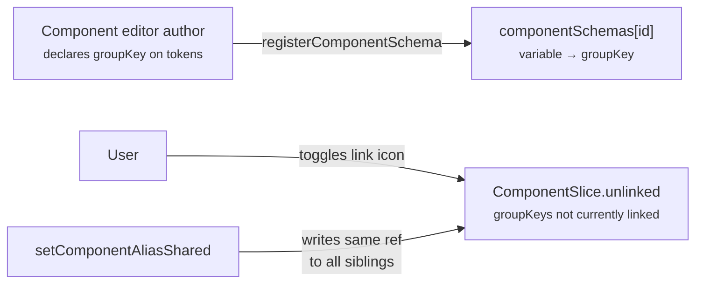
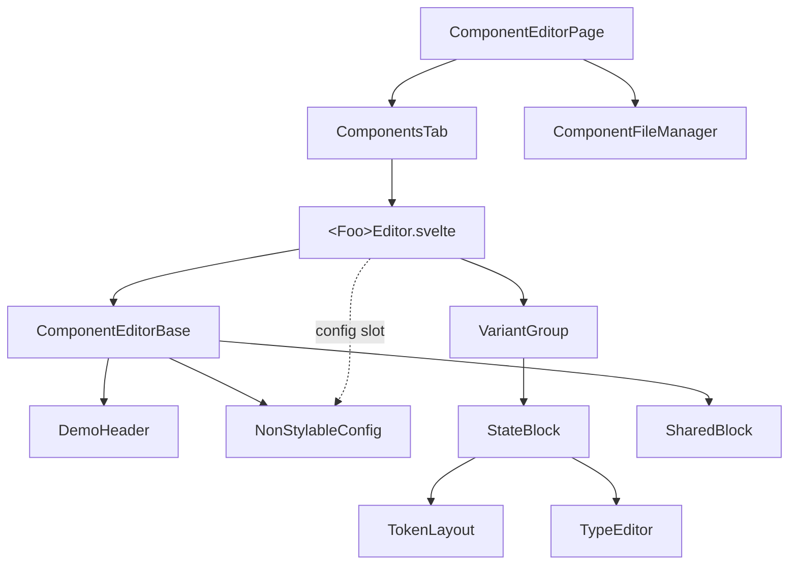

# The component system

This chapter is for anyone working with the component editor: adding new
components, extending existing ones, or understanding how shared-block linking,
variant groups, and the alias-vs-config split fit together.

## The registry — single source of truth

`src/component-editor/registry.ts` is the **only** file that needs to know about
every component. Each entry binds a canonical lowercase id to its display
metadata, source file, editor component, and token schema:

```ts
export const componentRegistry: Readonly<Record<ComponentId, RegistryEntry>> = Object.freeze({
  segmentedcontrol: {
    id: 'segmentedcontrol',
    label: 'Segmented Control',
    icon: 'fas fa-hand-pointer',
    sourceFile: 'src/components/SegmentedControl.svelte',
    editorComponent: SegmentedControlEditor,
    schema: segmentedControlTokens,         // imported from the editor's <script context="module">
  },
  /* …14 entries… */
});
```

Adding a component means: author the runtime `.svelte`, author its editor (with
`<script context="module">` exporting `allTokens`), then add **one** entry to the
registry. Display order in the nav rail follows
`Object.values(componentRegistry)` order.

The registry consumes:

- `defaultSections` (the `ComponentsTab` section list).
- `componentSources` (the "Source" link target).
- `componentNavItems` in `ComponentEditorPage.svelte`.

All three derive from `componentRegistryEntries`. Schema registration also runs
eagerly at module load:

```ts
for (const entry of componentRegistryEntries) {
  registerComponentSchema(entry.id, entry.schema);
}
```

That replaces what used to be 14 implicit-on-import side-effect calls
(`registerComponentSchema(...)` at the top of each editor's `<script>`) with one
loop in one place.

### Boot-time validation

`validateRegistryAgainstServerScan(serverIds)` compares the registry's id list
to the filesystem scan returned by `/api/component-configs`. It logs warnings on
either-direction drift:

- **Registered components missing from server scan.** A registry entry whose
  runtime `.svelte` file isn't on disk (or has the wrong filename casing).
- **Components on disk not in registry.** A `src/components/<X>.svelte` file
  with no matching registry entry; the editor will ignore it.

That's what catches "I added the runtime + the editor, forgot to register it."
Without the validation the component would silently miss the nav rail.

## Editor schema — `allTokens`

Each component editor's `<script context="module">` block exports `allTokens:
Token[]` — the editor's declarative description of its token surface:

```ts
// component-editor/StandardButtonsEditor.svelte (excerpt)
<script context="module" lang="ts">
  export const component = 'button';

  const variants = ['primary', 'secondary', 'outline', 'success', 'danger', 'warning'] as const;
  const stateNames = ['default', 'hover', 'disabled'] as const;

  function variantStateTokens(v, s) {
    const p = s === 'default' ? `--button-${v}` : `--button-${v}-${s}`;
    return [
      { label: 'surface color', variable: `${p}-surface` },
      { label: 'border color', variable: `${p}-border` },
      { label: 'border width', canBeShared: true, groupKey: 'border-width', variable: `${p}-border-width` },
      { label: 'corner radius', canBeShared: true, groupKey: 'radius', variable: `${p}-radius` },
      { label: 'padding', canBeShared: true, groupKey: 'padding', variable: `${p}-padding` },
    ];
  }

  export const allTokens: Token[] = variants.flatMap((v) => [
    ...stateNames.flatMap((s) => variantStateTokens(v, s)),
    ...buildTypeGroupTokens(variantTypeGroups(v)),
  ]);
</script>
```

The `Token` shape:

```ts
type Token = {
  label: string;          // human-readable label in the editor row
  variable: string;       // CSS custom property name
  canBeShared?: boolean;  // shows the link toggle in the row
  groupKey?: string;      // sibling-set identifier (overrides last-dash fallback)
  disabled?: boolean;     // greyed out (still visible)
  hidden?: boolean;       // omitted entirely
  mergeVariables?: string[]; // shared-block extension (computed, not authored)
};
```

Placement matters: the registry imports `allTokens` directly from the
`<script context="module">` block, without instantiating the editor component.
That's what makes `registerComponentSchema` a one-time eager call rather than an
effect of mounting.

## The alias / config split

A `ComponentSlice` (per-component state) has two buckets:

```ts
interface ComponentSlice {
  activeFile: string;
  aliases: Record<string, CssVarRef>;     // CSS-var aliases: token or literal
  config: Record<string, unknown>;        // literal-valued knobs read by JS
  unlinked?: string[];                    // groupKeys explicitly unlinked
}

type CssVarRef =
  | { kind: 'token'; name: string }       // emits as var(<name>)
  | { kind: 'literal'; value: string };   // emits as the raw value
```

The split was the C3 audit fix. The rule:

| If the consumer reads via | Bucket |
|---|---|
| `var(--name)` in CSS cascade (any `var()` reference, any `color-mix(...)` form, the renderer-emitted property declaration) | **`aliases`** |
| JS via `$editorState.components[id].config[key]` (e.g., `<Dialog confirmVariant={...}>`) | **`config`** |

Examples of each:

```ts
// aliases — CSS cascade resolves via var()
slice.aliases['--button-primary-surface'] = { kind: 'token', name: '--surface-primary' };
slice.aliases['--button-shimmer']         = { kind: 'token', name: '--shimmer-on' };
slice.aliases['--button-outline-surface'] = { kind: 'literal',
  value: 'color-mix(in srgb, var(--surface-neutral-lowest) 60%, transparent)' };

// config — JS-side knobs
slice.config['--dialog-confirm-variant'] = 'primary';   // <Dialog> reads this
slice.config['--dialog-cancel-variant']  = 'outline';
```

The renderer emits `--button-primary-surface: var(--surface-primary);` for the
first entry, `--button-shimmer: var(--shimmer-on);` for the second, and the raw
`color-mix(...)` expression for the third. It **doesn't emit anything** for the
config bucket; config is for JS readers, not the cascade.

### Disk-shape vs in-memory

On disk both buckets are flat:

```jsonc
{
  "aliases": { "--button-primary-surface": "--surface-primary",
               "--button-shimmer": "--shimmer-off" },
  "config":  { "--dialog-confirm-variant": "primary" }
}
```

On load, `splitAliasesAndConfig` (in `editorStore.ts`) does the routing:

1. Run migrations whose `fromVersion >= file.schemaVersion`.
2. For each entry in the post-migration aliases map:
   - If the key is in `KNOWN_COMPONENT_CONFIG_KEYS`, route to `config` (handles
     legacy single-bucket files).
   - Otherwise if the value starts with `--`, wrap as `{kind: 'token', name:
     value}`.
   - Otherwise, wrap as `{kind: 'literal', value}`.
3. Anything in the file's `config` field is merged in as-is.

Save reverses the split: aliases go back to flat strings (token refs become
their `name`, literals become their `value`); config is written as-is. The
on-disk shape stays stable across the in-memory restructure, so old files load
cleanly without rewrite.

## Sibling sharing

A sibling set is a group of tokens that **can** be linked together. The user
toggles whether a set is *currently* linked via the link icon in each row; the
*topology* of what can be linked is dev-declared.



### The schema (dev-declared)

`registerComponentSchema(componentId, tokens)` registers the per-component
`variable → groupKey` mapping. The schema gets consulted first when looking up
siblings. For unmigrated tokens with no schema entry, fallback is "split on the
last dash" (e.g., `--button-primary-surface` → group `surface`).

The fallback is documented in `src/styles/CONVENTIONS.md`. It's why the project
sometimes uses `-thickness` or `-height` instead of `-width`: when two unrelated
slots both end in `-width` and neither has a `groupKey`, fallback auto-groups
them. The recommended fix is always to declare a `groupKey`; the
alternative-property-word workaround exists for legacy parity.

### The `unlinked` flag (user-toggled)

`ComponentSlice.unlinked` is a list of `groupKey` strings the user has
explicitly broken apart. While a groupKey sits on the unlinked list, siblings
are independently editable; clicking the link icon again clears it from the
list.

`unlinked` lives on the slice (not on the schema) so it persists with the user's
saved config. Unlinking is a property of *this saved theme of the button*, not
of the button's design.

### The shared block

The `<SharedBlock>` is the row-strip at the top of each editor that displays one
row per linked group, so the user can edit a property once instead of N times.
`computeSharedBlock(component, shareableContexts, allTokens)`
(`src/component-editor/scaffolding/sharedBlock.ts`) builds it, and
`<SharedBlock>` in `ComponentEditorBase` renders it.

```ts
const shareableContexts = new Map<string, string>([
  ['--button-primary-text-font-family', 'primary'],
  ['--button-secondary-text-font-family', 'secondary'],
  /* …one entry per shareable variable, mapping it to a context label… */
]);
```

`shareableContexts` is the per-editor declaration of "for these variables,
here's the label to show in the shared block when their groupKey collapses."
Editors declare this in their `<script context="module">` block.

`computeSharedBlock` walks the contexts:

1. For each variable in `shareableContexts`, look up its siblings via
   `getComponentPropertySiblings`.
2. If `siblings.length >= 2`, form a group with the rep token + sibling list +
   collected context labels.
3. Mark every other declared peer of the same `groupKey` as already seen, so
   they don't spawn duplicate groups.
4. Compute `mergePeers` — declared peers in `shareableContexts` that aren't in
   the slice yet — so a single user write propagates to the full declared
   topology (not just the subset already in the slice).

The result feeds `ComponentEditorBase`'s shared-block context, and `TokenLayout`
reads back via `getEditorContext().sharedOrder` to align rows visually.

## Scaffolding components



The standard editor shape:

```svelte
<ComponentEditorBase {component} title="Foo" tokens={allTokens} {shared} tabbable variants={variantOptions}>
  <svelte:fragment slot="config">
    <!-- non-stylable knobs (toggles, dropdowns) — set via setComponentConfig() -->
  </svelte:fragment>

  {#each variants as v}
    <VariantGroup
      name={v}
      title={v}
      states={visibleVariantStates(v)}
      typeGroups={variantTypeGroups(v)}
      {component}
      siblings={buildSiblings(variants, v, variantStates, variantTypeGroups)}
      let:activeState
    >
      <!-- the live preview, slotted in -->
      <Foo variant={v} disabled={activeState === 'disabled'} />
    </VariantGroup>
  {/each}
</ComponentEditorBase>
```

The pieces:

- **`ComponentEditorBase`.** Owns the demo block chrome, the variant tab strip
  (when `tabbable`), the shared block, and the editor context
  (`createEditorContext`).
- **`VariantGroup`.** One per variant, with optional state sub-grouping and a
  "Copy from" menu sourced from `siblings`.
- **`StateBlock`.** The inner `<TypeEditor>` + `<TokenLayout>` block; shared
  between VariantGroup's tabs and list rendering modes.
- **`TokenLayout`.** Dispatches each token row to the right `<UI*Selector>`
  based on the token's variable-name suffix (or explicit kind).
- **`TypeEditor`.** Renders typography fieldsets (`TypeGroupConfig` rows: color
  + family + size + weight + line-height).
- **`SharedBlock`.** Row-strip rendered by `ComponentEditorBase` when `shared`
  is passed.

### Helpers

| Helper | What it builds |
|---|---|
| `buildTypeGroupTokens(typeGroups)` | The Token entries for color + 4 font-shape props per type group, with stable groupKeys (`font-family`, `font-size`, `font-weight`, `line-height`). |
| `buildTypeGroupShareableContexts(typeGroups)` | Companion: `[variable, stateName]` pairs for shareable-context Maps. |
| `buildSiblings(variants, toVariant, variantStates, variantTypeGroups?)` | The `siblings` list a VariantGroup needs for its "Copy from" menu. Returns every variant *except* `toVariant`. |
| `computeSharedBlock(component, contexts, allTokens)` | Compute the shared-block groups; called reactively from each editor. |
| `withSharedDisabled(tokens, sharedSet)` | Mark tokens currently in the shared block as `disabled: true` so the per-state rows render greyed out. |

Editors that hand-list 16 typography tokens are a regression. The codebase
already knows how to derive these (`StandardButtonsEditor`, `RadioButtonEditor`);
extend the helpers if a new editor needs a variant they don't cover.

## State model invariants

Two things get routinely confused; they're separate concepts:

**Component states** are `default` / `selected` / `disabled`. Mutually
exclusive. A SegmentedControl option is exactly one of these at a time.
**Disabled is terminal.** A disabled selected button isn't a thing, because once
disabled it should look *disabled*, not "the selected variant's disabled style."
Selected-disabled is impossible by construction.

**Interaction states** are `default` / `hover`. They layer on top of component
states and apply to anything pointer-interactive. A hover *on* a disabled
element is also impossible (the cursor doesn't get the hover affordance).

**Parts** are Dialog's `overlay` / `header` / `body` / `footer`, Tooltip's
arrow, SegmentedControl's bar / option / divider. These are **structural
parts**, not states. The `DialogEditor`'s `frameStates` keys parts as states
because the editor UI naturally renders one block per part, but if a
state-machine type ever gets introduced, parts and states must be different
types.

If you reintroduce a singular "State" label anywhere, pick the right noun per
`VariantGroup`: "Variants", "Frames", or "Parts," based on what the group is.
The Tabs view sidesteps this because each tab is named individually.

## Summary

- One registry entry per component → label, icon, source file, editor, schema.
  The registry is the source of truth; everything else derives.
- Token schema goes in the editor's `<script context="module">` as `allTokens`,
  imported by the registry, registered eagerly at module load.
- Aliases are CSS-var refs (token or literal) consumed by the cascade. Config is
  for JS readers. Don't mix them.
- Sibling sharing is dev-declared via `groupKey` + `registerComponentSchema`;
  users toggle the link, they don't define it.
- Disabled is terminal; selected-disabled is impossible. Parts ≠ states.
