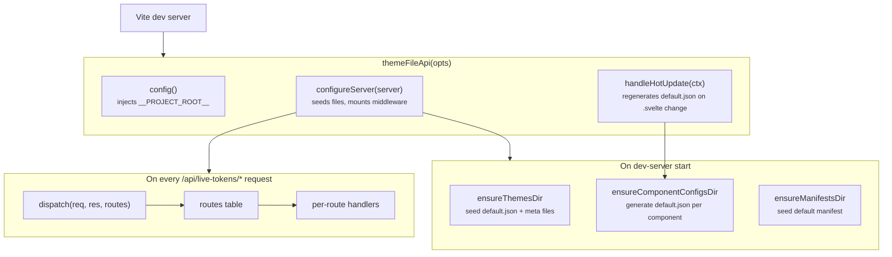
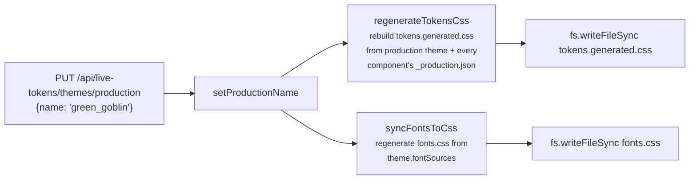

# Dev-server plugin

The Vite plugin lives in `vite-plugin/` at the repo root. It turns
"save in the editor" into "JSON file on disk." Its entry point is
`themeFileApi(opts)`, exported from `vite-plugin/index.ts` and
consumed via the `@motion-proto/live-tokens/vite-plugin` subpath
export.

The plugin is dev-only. Production builds do not include it;
production reads `tokens.css` and `fonts.css` as static CSS, with no
`/api/live-tokens/*` routes involved.

## Configuration

```ts
// vite.config.ts
import { themeFileApi } from '@motion-proto/live-tokens/vite-plugin';

export default defineConfig({
  plugins: [
    svelte(),
    themeFileApi({
      tokensCssPath: 'src/system/styles/tokens.css',
      // Optional overrides:
      fontsCssPath: 'src/system/styles/fonts.css',     // default: sibling of tokensCssPath
      apiBase: '/api/live-tokens',                      // default; namespaces routes so they can't collide with consumer middleware
      dataDir: 'src/live-tokens/data',                  // default; relocates all three subfolders
      themesDir: 'src/live-tokens/data/themes',         // default: <dataDir>/themes
      componentConfigsDir: 'src/live-tokens/data/component-configs', // default: <dataDir>/component-configs
      manifestsDir: 'src/live-tokens/data/manifests',   // default: <dataDir>/manifests
      componentsSrcDir: 'src/system/components',
    }),
  ],
});
```

### `live-tokens.config.json` (optional)

Consumers who prefer JSON to TypeScript can place a
`live-tokens.config.json` at the project root with the same four
data-folder keys:

```json
{
  "dataDir": "src/live-tokens/data",
  "themesDir": "src/live-tokens/data/themes",
  "componentConfigsDir": "src/live-tokens/data/component-configs",
  "manifestsDir": "src/live-tokens/data/manifests"
}
```

All keys are optional. Resolution order, per folder:

1. Explicit `themeFileApi(opts)` argument
2. Matching key in `live-tokens.config.json`
3. `<dataDir>/<sub>` where `dataDir` comes from opts
4. `live-tokens.config.json`'s `dataDir`
5. Package default `src/live-tokens/data`

The file is read once at vite-plugin construction time; restart the
dev server to pick up changes.

The same lookup is used by `loadProductionConfig` (build-time
pruning) so `buildPruneReplace()` and `themeFileApi()` always resolve
to the same `component-configs` location.

## What it does



Three responsibilities:

1. **Seed defaults.** On first start, write
   `<dataDir>/themes/default.json` if missing, regenerate
   `<dataDir>/component-configs/<id>/default.json` from each
   component's `:global(:root)` block, and seed
   `<dataDir>/manifests/default.json`.
2. **Serve `/api/live-tokens/*`.** Themes CRUD, component-config
   CRUD, manifests CRUD.
3. **Inject `__PROJECT_ROOT__`.** Vite `define` so
   `LiveEditorOverlay`'s "Page Source" button can build
   `vscode://file/<root>/<path>` URLs without each consumer adding
   their own `define`.

## Route table

The middleware uses a route table dispatched by `dispatch(req, res,
routes)` (`vite-plugin/files/routeTable.ts`). Each route is
`{ method, pattern, handler }`; `pattern` is either a literal string
for exact-match URLs or a `RegExp` for parameterised ones. The
dispatcher walks the table in order, runs the first match, and
catches all throws into a 500 JSON response so handlers can be
linear and just throw on error.

Order matters because the `RegExp`s overlap. The active/production
patterns must come **before** the catch-all `:name` patterns:

```
/api/live-tokens/component-configs/button/active     ← matches COMP_ACTIVE_REGEX
/api/live-tokens/component-configs/button/production  ← matches COMP_PRODUCTION_REGEX
/api/live-tokens/component-configs/button/default_01  ← matches COMP_BY_NAME_REGEX
```

Without explicit ordering, the third pattern would also match the
first two with `name='active'` or `name='production'`. The route
table is the explicit ordering.

## Endpoints

### Themes

| Method | Path | Purpose |
|---|---|---|
| `GET` | `/api/live-tokens/themes` | List themes (name, fileName, updatedAt, isActive) |
| `GET` | `/api/live-tokens/themes/active` | Get the active theme JSON |
| `PUT` | `/api/live-tokens/themes/active` | Set the active theme. Body: `{name}` |
| `GET` | `/api/live-tokens/themes/production` | Get the production theme info |
| `PUT` | `/api/live-tokens/themes/production` | Promote a theme to production. Runs `regenerateTokensCss + syncFontsToCss` |
| `GET` | `/api/live-tokens/themes/:name` | Get a theme JSON |
| `PUT` | `/api/live-tokens/themes/:name` | Save a theme; if `:name` is the production theme, also re-runs the regenerate/sync |
| `DELETE` | `/api/live-tokens/themes/:name` | Delete (rejected for `default`); if it was active, fall back to `default` |

### Component configs

| Method | Path | Purpose |
|---|---|---|
| `GET` | `/api/live-tokens/component-configs` | List components: `[{name, activeFile, productionFile}]` |
| `GET` | `/api/live-tokens/component-configs/:comp/active` | Active config JSON |
| `PUT` | `/api/live-tokens/component-configs/:comp/active` | Set active. Body: `{name}` |
| `GET` | `/api/live-tokens/component-configs/:comp/production` | Production config metadata and aliases |
| `PUT` | `/api/live-tokens/component-configs/:comp/production` | Promote. Runs `regenerateTokensCss` |
| `GET` | `/api/live-tokens/component-configs/:comp/:name` | Get config JSON |
| `PUT` | `/api/live-tokens/component-configs/:comp/:name` | Save (rejected for `default`) |
| `DELETE` | `/api/live-tokens/component-configs/:comp/:name` | Delete (rejected for `default`); active and production fall back to `default` |
| `GET` | `/api/live-tokens/component-configs/:comp` | List configs for one component |

### Manifests

| Method | Path | Purpose |
|---|---|---|
| `GET` | `/api/live-tokens/manifests` | List manifests |
| `GET` | `/api/live-tokens/manifests/active` | Get the active manifest JSON |
| `PUT` | `/api/live-tokens/manifests/active` | Set active. Body: `{name}` |
| `GET` | `/api/live-tokens/manifests/:name` | Get a manifest JSON |
| `PUT` | `/api/live-tokens/manifests/:name` | Save (rejected for `default`) |
| `DELETE` | `/api/live-tokens/manifests/:name` | Delete (rejected for `default`) |
| `PUT` | `/api/live-tokens/manifests/:name/apply` | Atomic apply: flip theme plus each component's `_active.json` pointer; return resolved theme and configs |

## `versionedFileResource`

Themes, per-component configs, and manifests use the same
active/production vocabulary. That vocabulary is implemented once,
in two halves:

- **Server.** `vite-plugin/files/versionedFileResourceServer.ts`
  exports `versionedFileResourceServer({dir, defaultName?})`. Returns
  `{ ensureDir, ensureMeta, filePath, getActiveName, getProductionName,
  setActiveName, setProductionName }`.
- **Client.**
  `src/editor/core/storage/files/versionedFileResourceClient.ts`
  exports `versionedFileResource<T, M, P>({baseUrl})`. Returns
  `{ list, load, save, remove, getActive, setActive,
  getProductionInfo, setProduction }`.

The themes resource and the manifests resource are constructed once
at plugin init; per-component resources are **lazily** constructed
on first access via the `componentResource(comp)` cache. That
matters because the set of components is discovered at runtime from
`src/system/components/*.svelte`; there is no static list.

## Sync functions

When a theme is **promoted to production** (or a save lands on the
already-production theme), two passes run:



### `regenerateTokensCss()`

Rewrites the editor-owned `tokens.generated.css` sidecar from
scratch on every call. The developer-authored `tokens.css` is never
written; it holds defaults the user is free to hand-edit and stays
the single source of truth for primitives. The generated file is
imported immediately after `tokens.css` and uses `:root:root`
selectors (specificity 0,0,2) so its overrides win over the defaults
(0,0,1) and the component-default `:global(:root)` blocks (0,0,1)
regardless of CSS chunk ordering.

The file has two sections:

1. **Production-theme overrides.** Palette ramps, font stacks,
   custom vars, emitted as one `:root:root { ... }` block.
2. **Component aliases.** For each component whose production config
   differs from its `default.json`, the diff lands as a comment plus
   override block:

```css
/* Production theme: green_goblin */
:root:root {
  --surface-primary: oklch(0.55 0.18 142);
  /* ... */
}

/* Component aliases (production configs differing from defaults) */
:root:root {
  /* button (green_goblin_button) */
  --button-primary-surface: var(--surface-success);
  --button-primary-hover-surface: var(--surface-success-high);
  /* ... */
}
```

When a component's production points to `default`, no overrides are
emitted (the source `.svelte` is authoritative).

### `syncFontsToCss(fileName)`

Regenerates `fonts.css` from the theme's `fontSources`. Each source
emits one block:

- `font-face` sources contribute their `cssText` verbatim.
- `google`, `typekit`, `css-url` sources emit
  `@import url('<url>');`.

The file is fully overwritten. Fonts are an opaque registry, not a
hand-edited file.

## Hot-update: regenerating defaults

`handleHotUpdate(ctx)` listens for changes to
`src/system/components/*.svelte`. When a component's source changes:

```mermaid
sequenceDiagram
    participant Vite
    participant Plugin as themeFileApi
    participant Parser as extractGlobalRootBody
    participant FS as &lt;dataDir&gt;/component-configs/&lt;comp&gt;/default.json

    Vite->>Plugin: handleHotUpdate({file})
    Plugin->>Plugin: file in COMPONENTS_SRC_DIR && .svelte?
    Plugin->>FS: read existing default.json (preserve createdAt)
    Plugin->>Parser: parse :global(:root) block
    Parser-->>Plugin: { '--btn-...': '--surface-...', ... }
    Plugin->>FS: write new default.json
```

The editor does not need a full reload. `componentConfigService`
re-fetches the new defaults on its next call, and runtime state
owns the override layer regardless.

The HMR check uses `defaultStat.mtimeMs >= sourceStat.mtimeMs` to
skip regeneration when the existing default is already newer (which
happens on plugin restart against files that have not changed).
`createdAt` is preserved across regeneration.

## Project root injection

```ts
config() {
  return {
    define: {
      __PROJECT_ROOT__: JSON.stringify(process.cwd()),
    },
  };
}
```

`LiveEditorOverlay` reads `__PROJECT_ROOT__` (with a `declare const`
fallback so TypeScript-only consumers do not need an ambient global)
to build the `vscode://` links for the "Page Source" button. The
plugin handles the injection so library consumers do not need to add
their own `define` entry. The README's `vite.config.ts` example
explicitly notes "You don't need a `define` entry for this."

## Sanitisation and path safety

User-provided file names go through `sanitizeFileName(name)`:

```ts
sanitizeFileName('My Theme!')  // → 'my_theme'
```

Allowed characters are `[a-z0-9_]`; everything else collapses to
`_`, then leading and trailing underscores trim. The same helper is
used on the client (so the editor displays the post-sanitise name
before saving) and on the server (so requests with unsanitised names
get coerced). Both halves import from
`src/editor/core/storage/files/versionedFileResourceClient.ts` (the
canonical pure helper) so they cannot drift.

User-supplied path components (`:name`, `:comp`) are also constrained
at the route-pattern level: every regex uses `[a-z0-9\-_]+`, so `..`
and `/` never reach the handlers in the first place.

## Summary

- One Vite plugin, one route table, one dispatcher with centralised
  500-on-throw.
- Themes, component configs, and manifests share the
  `versionedFileResource` vocabulary: server half (filesystem ops
  plus active/production pointers) plus client half (REST shape).
- Promote-to-production triggers two syncs that rewrite
  `tokens.generated.css` and `fonts.css` in place; the former uses
  `:root:root` to override defaults regardless of chunk order.
- HMR regenerates per-component `default.json` from the Svelte
  source's `:global(:root)` block on every save.
- `__PROJECT_ROOT__` is injected by the plugin so the overlay's
  "Page Source" link works without consumer config.
