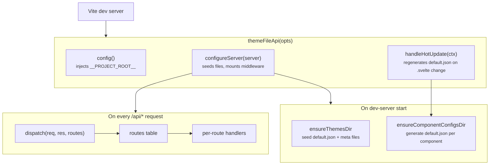
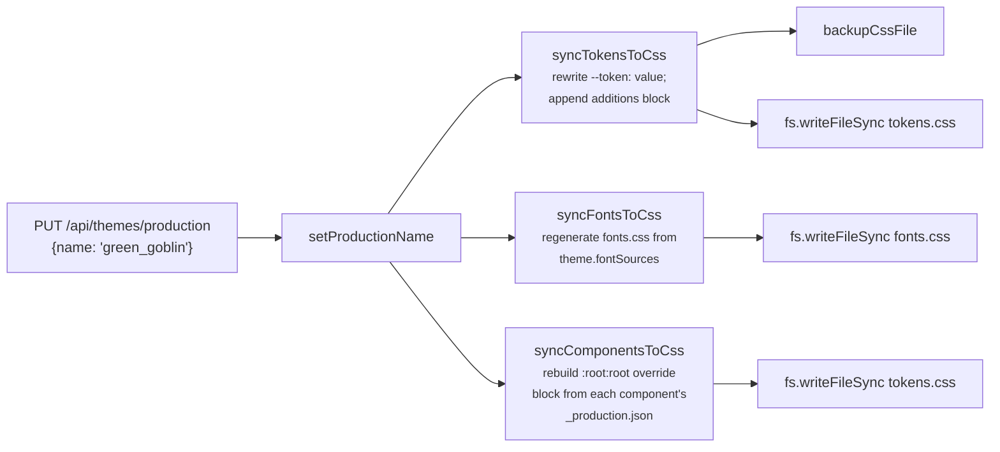
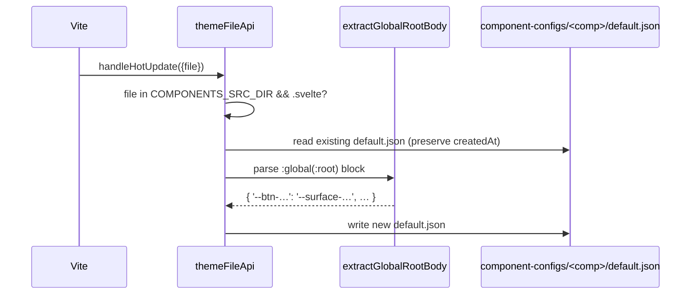

# Dev-server plugin

The Vite plugin lives in `src/vite-plugin/` and is what turns "save in the editor" into
"JSON file on disk." Its entry point is `themeFileApi(opts)`, exported from
`src/vite-plugin/index.ts` and consumed via the `@motion-proto/live-tokens/vite-plugin`
subpath export.

The plugin is **dev-only**. Production builds don't include it; production reads
`tokens.css` and `fonts.css` as static CSS, with no `/api/*` routes involved.

## Configuration

```ts
// vite.config.ts
import { themeFileApi } from '@motion-proto/live-tokens/vite-plugin';

export default defineConfig({
  plugins: [
    svelte(),
    themeFileApi({
      themesDir: 'themes',
      tokensCssPath: 'src/styles/tokens.css',
      // Optional overrides:
      fontsCssPath: 'src/styles/fonts.css',           // default: sibling of tokensCssPath
      themesBackupDir: 'themes/_backups',             // default: themesDir/_backups
      cssBackupDir: 'src/styles/_backups',            // default: cssPath dir/_backups
      apiBase: '/api',                                // default: '/api'
      componentConfigsDir: 'component-configs',
      componentsSrcDir: 'src/components',
    }),
  ],
});
```

## What it does



Three responsibilities:

1. **Seed defaults** — on first start, write `themes/default.json` if missing and
   regenerate `component-configs/<id>/default.json` from each component's
   `:global(:root)` block.
2. **Serve `/api/*`** — themes CRUD, component-config CRUD, backups, current CSS.
3. **Inject `__PROJECT_ROOT__`** — Vite `define` so `LiveEditorOverlay`'s "Page Source"
   button can build `vscode://file/<root>/<path>` URLs without each consumer adding
   their own `define`.

## Route table

The middleware uses a route table dispatched by `dispatch(req, res, routes)`
(`src/vite-plugin/files/routeTable.ts`). Each route is `{ method, pattern, handler }`;
`pattern` is either a literal string for exact-match URLs or a `RegExp` for parameterized
ones. The dispatcher walks the table in order, runs the first match, and **catches all
throws → 500 JSON** so handlers can be linear and just throw on error.

Order matters because the `RegExp`s overlap. The active/production patterns must come
*before* the catch-all `:name` patterns:

```
/api/component-configs/button/active     ← matches COMP_ACTIVE_REGEX
/api/component-configs/button/production  ← matches COMP_PRODUCTION_REGEX
/api/component-configs/button/default_01  ← matches COMP_BY_NAME_REGEX
```

Without explicit ordering, the third pattern would also match the first two with
`name='active'` / `name='production'`. The route table is the explicit ordering;
the previous code maintained order-via-comment-warning.

## Endpoints

### Themes

| Method | Path | Purpose |
|---|---|---|
| `GET` | `/api/themes` | List themes (name, fileName, updatedAt, isActive) |
| `GET` | `/api/themes/active` | Get the active theme JSON |
| `PUT` | `/api/themes/active` | Set the active theme — body: `{name}` |
| `GET` | `/api/themes/production` | Get the production theme info |
| `PUT` | `/api/themes/production` | Promote a theme to production — runs `syncTokensToCss + syncFontsToCss + syncComponentsToCss` |
| `GET` | `/api/themes/:name` | Get a theme JSON |
| `PUT` | `/api/themes/:name` | Save a theme (backup-then-write); if `:name` is the production theme, also re-runs the syncs |
| `DELETE` | `/api/themes/:name` | Delete (rejected for `default`); if it was active, fallback to `default` |

### Component configs

| Method | Path | Purpose |
|---|---|---|
| `GET` | `/api/component-configs` | List components: `[{name, activeFile, productionFile}]` |
| `GET` | `/api/component-configs/:comp/active` | Active config JSON |
| `PUT` | `/api/component-configs/:comp/active` | Set active — body: `{name}` |
| `GET` | `/api/component-configs/:comp/production` | Production config metadata + aliases |
| `PUT` | `/api/component-configs/:comp/production` | Promote — runs `syncComponentsToCss` |
| `GET` | `/api/component-configs/:comp/:name` | Get config JSON |
| `PUT` | `/api/component-configs/:comp/:name` | Save (rejected for `default`) |
| `DELETE` | `/api/component-configs/:comp/:name` | Delete (rejected for `default`); active/production fall back to `default` |
| `GET` | `/api/component-configs/:comp` | List configs for one component |

### Backups

| Method | Path | Purpose |
|---|---|---|
| `GET` | `/api/backups` | List all backups across themes / css / component-configs (newest first) |
| `GET` | `/api/backups/:type/:file` | Read a single backup's content |
| `POST` | `/api/backups/:type/:file/restore` | Backup-current-then-restore the named backup |

### Current CSS

| Method | Path | Purpose |
|---|---|---|
| `GET` | `/api/current-css` | Read `tokens.css` (used by the editor's "Apply now" preview) |

## `versionedFileResource`

Both themes and per-component configs use the same active/production/backups vocabulary.
That vocabulary is implemented once, in two halves:

- **Server** — `src/vite-plugin/files/versionedFileResource.ts` exports
  `versionedFileResourceServer({dir, backupDir?, defaultName?})`. Returns
  `{ ensureDir, ensureMeta, filePath, getActiveName, getProductionName, setActiveName,
  setProductionName, backup }`.
- **Client** — `src/lib/files/versionedFileResource.ts` exports
  `versionedFileResource<T, M, P>({baseUrl})`. Returns `{ list, load, save, remove,
  getActive, setActive, getProductionInfo, setProduction }`.

The themes resource is constructed once at plugin init; per-component resources are
**lazily** constructed on first access via the `componentResource(comp)` cache. This
matters because the set of components is discovered at runtime from
`src/components/*.svelte` — there's no static list.

`BACKUP_RETENTION = 10` is a single constant on the server side. Both the
`backup(...)` method (per-name) and `trimFlatBackups(dir, prefix, ext)` (for the flat
`tokens_*.css` backups) honor it.

## Sync functions

When a theme is **promoted to production** (or a save lands on the already-production
theme), three syncs run:



### `syncTokensToCss(fileName)`

Reads the named theme, walks `tokens.css` line-by-line with a regex that matches
`--name: value;` declarations, and **replaces in place** the value of every variable
the theme overrides. Variables in the theme that don't already appear in the file land
in a trailing `/* Token additions */` block before the closing brace.

This in-place rewriting is intentional: it keeps `tokens.css` diffs minimal and
preserves the file's original ordering / comments / category headers, so designers can
hand-edit `tokens.css` and have their work survive a promote of the same theme.

### `syncFontsToCss(fileName)`

Regenerates `fonts.css` from the theme's `fontSources`. Each source emits one block:

- `font-face` sources contribute their `cssText` verbatim.
- `google` / `typekit` / `css-url` sources emit `@import url('<url>');`.

The file is fully overwritten — fonts are an opaque registry, not a hand-edited file.

### `syncComponentsToCss()`

Walks every component's `_production.json` and rebuilds a single `:root:root { … }`
block in `tokens.css` between `/* component-aliases:start */` and
`/* component-aliases:end */` markers:

```css
/* component-aliases:start */
:root:root {
  /* button (green_goblin_button) */
  --button-primary-surface: var(--surface-success);
  --button-primary-hover-surface: var(--surface-success-high);
  /* … */
}
/* component-aliases:end */
```

The `:root:root` selector has specificity (0,0,2) — higher than each component's own
`:global(:root)` declarations (0,0,1) — so production overrides win deterministically
regardless of CSS chunk ordering. When a component's production points to `default`,
no overrides are emitted (the source `.svelte` is authoritative).

## Hot-update: regenerating defaults

`handleHotUpdate(ctx)` listens for changes to `src/components/*.svelte`. When a
component's source changes:



The editor doesn't need a full reload — `componentConfigService` re-fetches the new
defaults on its next call, and runtime state owns the override layer regardless.

The HMR check uses `defaultStat.mtimeMs >= sourceStat.mtimeMs` to skip regeneration
when the existing default is already newer (which happens on plugin restart against
files that haven't changed). `createdAt` is preserved across regeneration.

## Project root injection

```ts
config() {
  return {
    define: {
      __PROJECT_ROOT__: JSON.stringify(process.cwd()),
    },
  };
}
```

`LiveEditorOverlay` reads `__PROJECT_ROOT__` (with a `declare const` fallback so
TypeScript-only consumers don't need an ambient global) to build the `vscode://`
links for the "Page Source" button. The plugin handles the injection so library
consumers don't need to add their own `define` entry — the README's `vite.config.ts`
example explicitly notes "You don't need a `define` entry for this."

## Sanitization

User-provided file names go through `sanitizeFileName(name)`:

```ts
sanitizeFileName('My Theme!')  // → 'my_theme'
```

Allowed characters are `[a-z0-9_]`; everything else collapses to `_`, then leading/
trailing underscores trim. The same helper is used on the client (so the editor
displays the post-sanitize name before saving) and on the server (so requests with
unsanitized names get coerced). Both halves import from `src/lib/files/versionedFileResource.ts`
— the canonical pure helper — so they can't drift.

## Path traversal protection

Backup-path handlers (`handleGetBackup`, `handleRestoreBackup`) all validate
`path.startsWith(<expectedDir>)` after resolving the user-provided file name. This
guards against `..` escapes in the URL path component. The check happens *after*
`path.join` resolves, so it catches both `../` and absolute-path injection.

## Summary

- One Vite plugin, one route table, one dispatcher with centralized 500-on-throw.
- Themes and component configs share the `versionedFileResource` vocabulary — server
  half (filesystem ops) + client half (REST shape).
- Promote-to-production triggers three syncs that rewrite `tokens.css` /  `fonts.css`
  in place; `tokens.css` ends up with a `:root:root` override block for component
  aliases.
- HMR regenerates per-component `default.json` from the Svelte source's
  `:global(:root)` block on every save.
- `__PROJECT_ROOT__` is injected by the plugin so the overlay's "Page Source" link
  works without consumer config.
