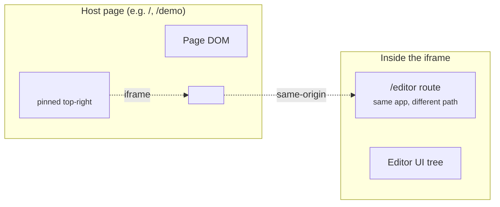
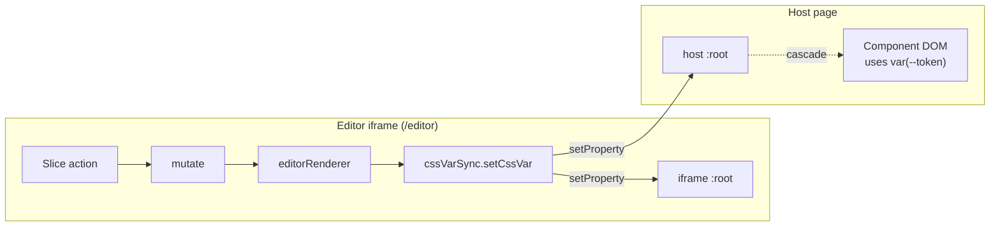
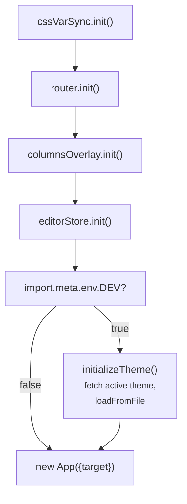

# Overlay, routing, and iframe fan-out

This chapter covers the editor's UI shell: the overlay pinned to the page corner,
the columns-grid debug overlay, the minimal router, and the iframe trick that
lets the editor (running inside an iframe) repaint the host page in real time.

## LiveEditorOverlay

`<LiveEditorOverlay />` is what the user sees pinned to the top-right of the
page in dev. It's a small pill in its collapsed state; clicked, it expands to a
panel containing an iframe that loads `/editor` (or whatever `editorPath` is
configured).



Three things matter and aren't obvious:

### 1. Self-gating

The overlay renders nothing unless **both** of:

- `import.meta.env.DEV` is true.
- It's not running inside an iframe (`window.parent === window`).

The iframe check matters: the editor page (which the overlay's iframe loads)
embeds the same app shell, and would otherwise recursively mount another
overlay inside itself. The overlay self-gates so consumers don't need
`{#if import.meta.env.DEV}` guards.

### 2. Lazy iframe mount

The iframe **mounts only after the first time the panel is opened**, then stays
mounted across collapse/expand cycles. That means:

- A user who never opens the editor pays no iframe cost (Vite doesn't load the
  editor bundle into a hidden subframe).
- A user who opens, edits, collapses, and re-opens has their editor state
  preserved. Unsaved slider values, scroll position, expanded sections all
  survive the hide/show.

The flag is `hasBeenOpen`, and stays true once flipped.

### 3. Docked vs floating

Two layout modes, with their own persisted geometry:

- **Docked.** Pinned to the right edge, full-height, resizable in width.
- **Floating.** Free-floating window, draggable + resizable.

The mode and each layout's geometry persist to localStorage via
`storageKey('overlay-state')`. Resize and drag gestures suppress CSS
transitions during the gesture so dragging doesn't re-animate every frame.

## CSS variable fan-out — the iframe trick

The headline architectural trick: the editor sits in an iframe over the host
page, but slider drags in the editor visually repaint the host page in real
time. There's no postMessage. The mechanism is `cssVarSync`
(`src/lib/cssVarSync.ts`):

```ts
function resolveParentRoot(): HTMLElement | null {
  if (typeof window === 'undefined') return null;
  try {
    if (window.parent !== window && window.parent?.document) {
      return window.parent.document.documentElement;
    }
  } catch { /* cross-origin parent — give up */ }
  return null;
}

export function setCssVar(name: string, value: string): void {
  ensureResolved();
  selfRoot?.style.setProperty(name, value);
  parentRoot?.style.setProperty(name, value);
  notifyChange(name);
}
```

When the editor (inside the iframe) writes a CSS variable, `setCssVar` writes
it to *both* document roots:



Because the editor and the host page are **same-origin** (both served by the
same Vite dev server, and the host's iframe `src` points back at the same
origin), the iframe can read `window.parent.document.documentElement` without
a cross-origin violation.

When the editor runs **standalone** (a user navigates directly to `/editor` in
a top-level window), `window.parent === window`, so `parentRoot` is null and
writes go to the editor's own document only. The same code path supports both
contexts; the editor doesn't need a "where am I running" branch.

### Why this matters for any state architecture

This is a load-bearing constraint. **Anything that writes to `:root` must go
through `cssVarSync`.** Direct `documentElement.style.setProperty(...)` calls
would only update the iframe and the host page would stay stale. The editor
renderer (`editorRenderer.ts`) is the only DOM consumer of state, and it
routes through `cssVarSync`. New code paths writing CSS vars (palette
derivation booting at startup, shadow seeding, gradient editor previews) all
go through `setCssVar` / `applyCssVariables`, never raw `style.setProperty`.

## Columns overlay

`<ColumnsOverlay />` is a debug overlay that draws the page-grid columns over
the page. Toggle it via `Cmd/Ctrl+G` (registered in `editorKeybindings.ts`) or
via the "Columns" button in the LiveEditorOverlay rail.

The visibility flag is `columnsVisible: Writable<boolean>` in
`src/lib/columnsOverlay.ts`. The store is **idempotently initialized** by
`init()`. `init()` hydrates the value from localStorage and starts a subscriber
that persists future writes:

```ts
export function init(): void {
  if (initialised) return;
  initialised = true;
  columnsVisible.set(quietGet(getStorageKey()) === '1');
  columnsVisible.subscribe((v) => {
    quietSet(getStorageKey(), v ? '1' : '0');
  });
}
```

The previous version of this module subscribed-and-persisted at module load.
That fired in any context that imported the module: SSR harnesses, unit tests,
library consumers booting in non-default order. It silently dirtied storage.
The idempotent `init()` is what made that safe; `main.ts` calls it explicitly
at boot. The same pattern (lazy roots in `cssVarSync`, lazy `prevKey()` in
`router`, lazy `getPersistKey()` in `editorPersistence`) is the project
convention for any module that needs DOM, storage, or window access.

## Router

`src/lib/router.ts` is a 50-line minimal pushState router:

```ts
export const route = writable<string>('/');

export function init(): void {
  if (initialised) return;
  initialised = true;
  if (typeof window === 'undefined') return;
  const initial = window.location.pathname || '/';
  rememberPrev(initial);
  route.set(initial);
  window.addEventListener('popstate', () => {
    route.set(window.location.pathname || '/');
  });
}

export function navigate(path: string) {
  const [pathname] = path.split('#');
  if (typeof window !== 'undefined') {
    rememberPrev(window.location.pathname || '/');
    history.pushState(null, '', path);
    if (!path.includes('#')) window.scrollTo(0, 0);
  }
  route.set(pathname);
}
```

Three things to note:

- **One `route.set` per `navigate()`.** The previous version dispatched a
  synthetic `PopStateEvent` whose listener also called `route.set`, producing
  two store writes per call. Dropped during the m9 audit fix.
- **Previous-route remembering.** `prevKey()` lazily resolves
  `storageKey('prev-route')` per call (M12 audit fix); `rememberPrev` writes to
  sessionStorage so the editor's "Back to site" button can restore the prior
  page.
- **Anchor-aware scroll.** Hash links (`#section`) don't `scrollTo(0, 0)`.

`<App.svelte>` intercepts plain anchor clicks on the host app (`a[href^="/"]`
without modifier keys) and calls `navigate(href)` so internal links route
through the router instead of triggering a full page load.

## Page-source button

The editor overlay can deep-link into VS Code at the source file for the
current route:

```ts
// LiveEditorOverlay.svelte (excerpt, simplified)
declare const __PROJECT_ROOT__: string | undefined;
$: sourceFile = pageSources[$route];
$: showSource = !!sourceFile && !!projectRoot && !hidePageSourceOn.includes($route);
$: vscodeUrl = showSource ? `vscode://file/${projectRoot}/${sourceFile}` : '';
```

`pageSources` is a `Record<routePath, sourceFile>` map passed by the consumer:

```svelte
<LiveEditorOverlay
  pageSources={{
    '/': 'src/pages/Home.svelte',
    '/components': 'src/pages/ComponentEditorPage.svelte',
  }}
/>
```

`projectRoot` defaults to the plugin-injected `__PROJECT_ROOT__`; consumers
can override it.

`hidePageSourceOn` is a list of routes where the button is suppressed. The
`/components` route uses this because its real "Source" affordance is the
`ComponentFileMenu` inside the page (which links to whichever component is
currently focused), not a single page source.

## Storage prefix

`configureEditor({storagePrefix: 'my-app-'})` sets a global prefix that every
`storageKey('foo')` call resolves through. That's what lets two consumers of
the library coexist on the same origin without their localStorage keys
colliding.

The keys used:

| Key | Owner | Purpose |
|---|---|---|
| `<prefix>editor-state` | `editorPersistence` | Full state JSON, debounced |
| `<prefix>columns-visible` | `columnsOverlay` | `'1'` / `'0'` |
| `<prefix>overlay-open` | `LiveEditorOverlay` | `'1'` / `'0'` |
| `<prefix>overlay-state` | `LiveEditorOverlay` | mode + dockedWidth + floating geometry |
| `<prefix>active-file` | `editorConfigStore` | Currently active theme name |
| `<prefix>prev-route` (sessionStorage) | `router` | Pre-`/editor` route for "back" |

All of these resolve `storageKey('foo')` lazily. Calling `configureEditor`
after one of these modules has been imported still affects writes that happen
after the call.

## Boot order

The boot sequence in `src/main.ts`:



The order matters in two places:

- `cssVarSync.init()` runs first because anything that calls `setCssVar`
  thereafter relies on the resolved roots.
- `editorStore.init()` (which runs `ensureHydrated`) runs before
  `initializeTheme()`. The theme load uses `loadFromFile`, which calls
  `resetHistoryForLoad()`, which expects the core to be initialized.

Library consumers replicate this in their own `main.ts`. The `init()` calls
are all idempotent, so calling them in extra places is safe.

## Summary

- The overlay self-gates (DEV + not-in-iframe), lazy-mounts the iframe, and
  remembers layout per-mode.
- `cssVarSync.setCssVar` writes to *both* the editor's document and the host's.
  That's what makes the iframe → host repaint work without postMessage.
- The columns overlay, router, persistence, and `cssVarSync` all use lazy
  `init()` to keep imports side-effect free; library consumers call them
  explicitly during boot.
- The page-source button is built from `__PROJECT_ROOT__` (plugin-injected)
  plus a consumer-supplied `pageSources` map.
- Storage keys are namespaced through `configureEditor({storagePrefix})`,
  resolved lazily so call ordering doesn't matter.
