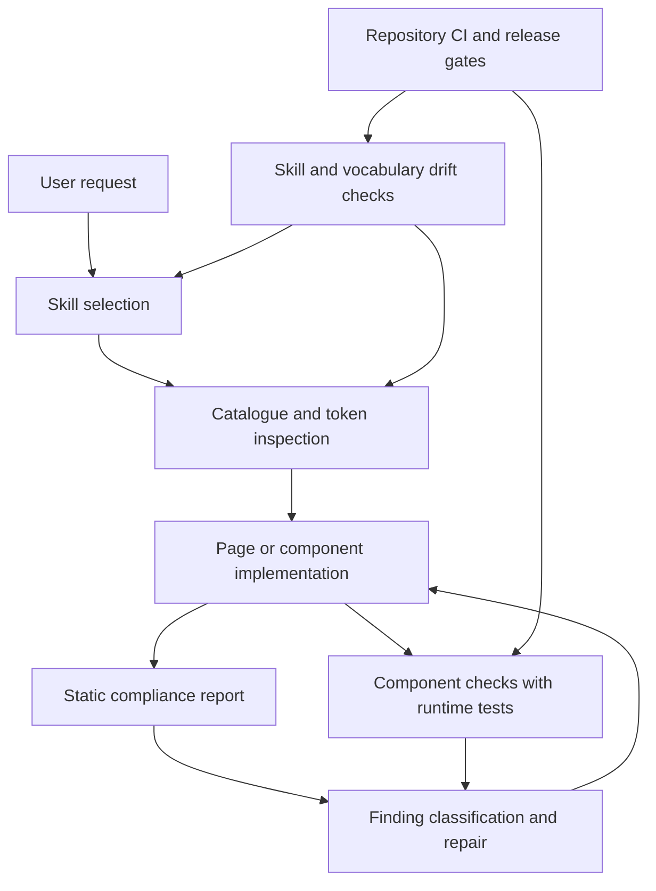

# LLM guidance architecture assessment

Assessment date: 9 September 2026. Repository package: `@motion-proto/live-tokens` 0.76.0.

## Overall assessment

The system has a strong foundation for maintaining component and token adherence. The skills give the agent a bounded workflow, the CLI supplies current project facts, and the test infrastructure checks whether semantic properties reach the rendered component and survive editing. This architecture makes adherence independently testable.

The largest weakness lies in the connections between those layers. A skill can require verification without ensuring that the agent runs it. A compliance report can show zero findings while omitting runtime evidence and excluded surfaces. A new component needs a custom runtime contract that the authoring recipe does not explain how to supply.

My assessment is **strong protection for established components within the tested contract, partial protection for page composition, and incomplete guidance for extending the catalogue**. Sustained adherence depends on completing the custom-component recipe, enforcing acceptance outside the agent, and measuring actual agent outcomes. More instructions alone will yield less value than those changes.

This review concerns the guidance and assurance architecture. It does not assess the visual quality of the design system.

## Architecture and evidence flow



These arrows represent code checks or workflow instructions; they do not all represent enforced execution. In particular, the agent must choose to follow the authoring and repair loop.

| Layer | Existing mechanism | Assurance and boundary |
| --- | --- | --- |
| Guidance | Nine Claude skills separate picking, page creation, component creation, theme work, auditing, and repair. | Clear task ownership; implicit activation and handoffs remain model behavior. |
| Discovery | `components`, `components <id>`, and `tokens --scale` inspect the installed project. | Reduces reliance on remembered APIs and invented token names. Source parsers limit discovery. |
| Guidance integrity | `check:skills`, `check:skill-atlas`, and `check:skill-sources`. | Checks vocabulary, CLI references, file references, and atlas drift. Does not measure successful delivery. |
| Static acceptance | `check-page` and `check-component`. | Checks recognized source forms, props, names, defaults, editor references, and registration. Does not establish complete semantic or runtime correctness. |
| Runtime acceptance | `check-component <id> --tests --strict --json`. | Runs registry and browser contracts, maps failures to rule IDs, and reconciles missing coverage. Requires tools, setup, and a contract for the component. |
| Reporting | `report --json`, followed by the compliance skill. | Summarizes static findings, token reads, registration, and usage. Does not run or attach runtime contracts. |
| Enforcement | Repository CI and `prepublishOnly`; repair skill adds consumer build checks. | Stronger in this repository than in a consumer that has only installed the skills. |

Sources: [authoring skill](../.claude/skills/live-tokens-create-component/SKILL.md), [compliance skill](../.claude/skills/live-tokens-check-compliance/SKILL.md), [skill checks](../scripts/lib/skillChecks.mjs), [CLI](../bin/cli.mjs), [contract runner](../bin/contractRunner.mjs), [verification workflow](../.github/workflows/verify.yml).

## Strengths

### The semantic property model gives the agent a concrete contract

The component recipe establishes a useful chain:

```css
:global(:root) {
  --statcard-padding: var(--space-16);
}
.statcard {
  padding: var(--statcard-padding);
}
```

The semantic property identifies a component role. The token supplies its default. The runtime consumes the property, and the editor changes its assignment. Stable role names let a theme change values without changing component anatomy or public props.

The skill also separates parts, variants, and states; keeps content and behavior in props; distinguishes structural intrinsics from themeable values; and treats new design tokens as a separate design-system change. These rules provide a coherent basis for new components. The required property map makes the intended relationship reviewable before implementation.

### Guidance shares vocabulary with implementation

`KIND_RULES` supplies the suffix vocabulary that selects editor controls. The component checker reads that vocabulary, and `check:skills` checks the token-naming reference against it in both directions. CLI coverage checks also catch missing verbs, retired flags, broken references, and absent sibling skills.

This connection prevents a major class of drift: a skill teaching names or commands that the installed tooling rejects. The atlas checks keep the visible explanation aligned with the skill source. CI runs all three skill gates on pull requests and pushes to main. [Vocabulary](../src/editor/core/components/aliasKinds.ts), [drift checks](../scripts/lib/skillChecks.mjs), [CI](../.github/workflows/verify.yml).

### Runtime contracts test the purpose of the token pattern

The contract infrastructure checks listing, alias inventory and resolution, rendering, state previews, interaction, persistence and reset, theme projection, and Sketch behavior. Its contract model maps parts and CSS properties to expected variables. This reaches beyond proving that a file contains `var(...)`.

The runner distinguishes passed, failed, flaky, inapplicable, incomplete, and disabled coverage. Missing tools, broken setup, and incomplete runs remain hard failures. Defect fixtures deliberately break paint mappings, interaction outcomes, persistence, theme assumptions, and inventory to test the checks themselves. These are substantial safeguards against empty or misleading passes. [Contract model](../src/testing/componentContract.ts), [runner](../bin/contractRunner.mjs), [defect fixtures](../tests/e2e/contract-defects/contract-defects.spec.ts).

The release workflow also includes a real tarball consumer smoke test. It exercises custom components, contracts, defects, and test isolation outside the repository layout. That addresses a weakness described in earlier audit documents. [Consumer gate](../scripts/smoke-component-tests.sh).

### Findings support a repeatable repair loop

Stable rule IDs, file locations, JSON output, and component `fix` slugs give agents an actionable interface. The audit skill separates mechanical replacements from decisions that require semantic judgment. The repair skill reruns checks and records remaining findings. This division keeps source analysis deterministic while letting the model explain consequences and choose repairs within the user's scope. [Finding model](../bin/lib/findings.mjs), [repair skill](../.claude/skills/live-tokens-fix-findings/SKILL.md).

## Weaknesses and implications

### 1. The custom-component recipe omits a required test artifact

**Priority: highest.** The skill promises a runtime file, an editor file, and registration, then requires complete runtime coverage. Its contract reference explains `registrySetup` and the registry assertions. Neither explains the `contractsModule` setting or how to author a `ComponentContract`.

The implementation loads custom browser contracts through `contractsModule`; registration alone supplies no such contract. A new component therefore reaches a gate whose setup the recipe leaves incomplete. The runner can expose missing coverage, but the agent must discover the missing architecture by reading implementation code.

Add the contract module to the component deliverables. Supply a minimal consumer example with part selectors, paint expectations, states, interaction, persistence, theme projection, Sketch coverage, and justified inapplicability. Link it directly from the workflow before verification. Prove that example in the tarball smoke test. [Skill reference](../.claude/skills/live-tokens-create-component/references/contract-tests.md), [testing config](../src/testing/config.ts), [custom contract loading](../src/testing/contracts/index.ts).

### 2. A clean report establishes a narrower result than its name suggests

**Priority: highest.** `report` performs static analysis and exits zero after producing its output, even when the output contains findings. It carries no runtime test results, revision identity, skill version, excluded-file inventory, or disabled-rule inventory. Its strict totals still respect rules set to `off`.

The review run reported 528 design tokens, 26 components, five page files, zero findings, and no pending migrations. All component entries had registration and description comments, with no unread tokens. However, the configuration excludes `src/demo`, `src/app/Home.svelte`, and `src/app/LabeledSelect.svelte`. The usage section listed every shipped component as unused within its discovered page scope. That result describes the selected source set, not all application use.

Report checked, excluded, undiscovered, and untested scope explicitly. Keep the static report fast, but allow it to attach runtime results with their source revision and configuration fingerprint. Label static cleanliness separately from runtime acceptance. [Report implementation](../bin/lib/report.mjs), [CLI exit behavior](../bin/cli.mjs), [project exclusions](../live-tokens.config.json).

### 3. Automatic discovery can omit incomplete components

**Priority: high.** `discoverComponents()` selects runtime files only when an editor file already exists. A runtime without its editor disappears from the automatic component-check set. A component outside `src/system/components` can appear in the configurable catalogue while remaining outside component validation.

An isolated probe confirmed that a runtime file without an editor yields an empty discovery list. An explicit check of its ID can report the missing file; the automatic sweep never selects it.

Use one inventory across catalogue, report, and validators. Discover candidates before validating their completeness. Require every candidate to receive a status: checked, incomplete, unsupported, or explicitly excluded. [Discovery implementation](../bin/check-component.mjs).

### 4. Token existence does not establish semantic correctness

**Priority: high.** The default checker verifies references against known names and rejects defaults without token references. It does not recursively prove that aliases terminate in valid design tokens, or that a token family matches the property's intended role.

Two isolated probes returned no default-check findings:

```css
/* Existing token, wrong family for the declared role. */
--probe-surface: var(--text-primary);

/* Known local names, cyclic dependency. */
--probe-surface: var(--probe-border);
--probe-border: var(--probe-surface);
```

These probes establish static-check limits. They do not show that the same defects pass complete browser contracts. Browser alias checks can expose invalid resolution, but a contract that repeats an author's wrong semantic choice can still validate that choice.

Add dependency-graph validation for cycles and unresolved chains. Extend property metadata with allowed token families where the role is definite. Retain a review step for choices such as neutral versus brand emphasis, because both may be mechanically valid. [Default checker](../bin/check-component.mjs), [runtime harness](../src/testing/support/contractHarness.ts).

### 5. Acceptance still depends on agent follow-through

**Priority: high.** The create-component skill requires tests, strict mode, complete applicable coverage, and no disabled checks. The create-page skill routes through the report and visual review. The repair skill adds a consumer `check:design` build step, but that command runs the two static checkers without `--strict` or `--tests`.

The repository has substantial CI coverage. Installing its skills in another project does not install an equivalent acceptance policy. Further, the component command's exit status follows surviving errors and hard failures; it does not independently reject every disabled coverage entry. The skill's completion standard is stronger than exit zero alone.

Provide one acceptance command that enforces the agreed policy and emits a durable result. Wire it into consumer CI during setup. Run static checks broadly and runtime contracts for affected components, with a full suite on shared token or editor changes. Include approved exceptions in the evidence. [Repair build hook](../.claude/skills/live-tokens-fix-findings/SKILL.md), [severity handling](../bin/lib/findings.mjs), [CLI](../bin/cli.mjs).

### 6. Agent effectiveness remains unmeasured, and the evals have drifted

**Priority: high.** The evaluation README states that its seven trigger cases and three outcome cases have never run. It records an early-access restriction from 2 September; this review did not recheck account availability. Static skill checks cannot establish activation accuracy, repair success, or improvement over a model without the skills.

The component tool grader matches `check-component rating --strict`. The current skill prescribes `check-component <id> --tests --strict --json`, so correct flag order can fail that matcher. The page grader requires an explicit `check-page ...Pricing.svelte --strict` call, while the current page skill delegates verification to `report`. These are concrete inconsistencies between the present workflows and their evaluation criteria.

Run outcome evaluations through an available harness, preserving a baseline without skills. Parse commands as arguments and grade final artifacts and machine results. Measure successful delivery, complete coverage, repairs, unauthorized suppression changes, and semantic decisions across repeated runs. [Eval status](../.claude/evals/README.md), [component grader](../.claude/evals/outcome-component-from-brief/graders/check-run.md), [page grader](../.claude/evals/outcome-page-from-brief/graders/check-run.md).

### 7. Coverage depends on the contract author's choices

**Priority: medium.** Contracts contain explicit paint maps, interaction cases, and theme observations. The inventory also accepts aliases in `uncovered`, with a reason. These mechanisms serve real cases, but complete rule coverage does not mean every visual property, state combination, breakpoint, or accessibility behavior has been tested.

The skill's statement that tests cover every line a reviewer once checked by eye overstates that assurance. The tests establish the obligations the contract declares and the harness enforces. Keep visual hierarchy, responsive composition, contrast on actual surfaces, and suitability of component choice as distinct review obligations.

Expose property-level coverage and exemptions alongside rule coverage. Review exemptions and use independent defect probes to challenge new contracts. Stable rule annotations would also reduce the runner's current dependence on test positions within the editor suite. [Contract model](../src/testing/componentContract.ts), [inventory](../src/testing/support/contractHarness.ts), [positional mapping](../bin/contractRunner.mjs).

### 8. Installed guidance can drift from its package

**Priority: medium.** `setup-claude` copies the skills into consumers. Existing directories are skipped unless `--force` is supplied. Forced setup replaces directories and prunes retired skills, which is useful, but the report does not expose a package-to-skill version mismatch.

Record the package version and skill hashes at installation. Check them during reporting and CI. Preserve intentional local edits through explicit overrides or a reviewable update diff. [Installer](../bin/setup-claude.mjs).

## Improvement sequence

| Order | Change | Acceptance evidence |
| --- | --- | --- |
| 1 | Complete the custom-contract authoring recipe and update outcome graders. | An agent creates a new component in a fresh consumer and reaches full applicable runtime coverage using the documented route. |
| 2 | Establish one acceptance command and consumer CI integration. | Missing tests, missing components, and unapproved suppressions prevent acceptance even if the agent stops early. |
| 3 | Add scope, exceptions, versions, and runtime evidence to reporting. | Every component and page has an explicit disposition; stale evidence is distinguishable from current evidence. |
| 4 | Unify discovery and validate alias dependency graphs and token families. | Negative fixtures detect missing editors, alternate component directories, alias cycles, and definite family mismatches. |
| 5 | Run repeated agent evaluations across hosts. | Stored traces and artifact results quantify skill contribution, failure patterns, and regressions. |
| 6 | Add property-level coverage and focused visual review. | A reviewer can identify untested states, unobserved properties, and judgments that automation leaves open. |

## ChatGPT and Codex application

The core architecture can transfer: the CLI, semantic model, contracts, and reports do not depend on Claude. The host needs access to the source tree and the ability to execute the verification tools.

Official OpenAI documentation describes `SKILL.md` directories with names, descriptions, references, and optional scripts for both ChatGPT and Codex. It documents explicit and implicit skill activation. Codex discovers repository skills under `.agents/skills`. These conventions support reusing the existing skill content through a host-specific installation adapter. [OpenAI skill documentation](https://learn.chatgpt.com/docs/build-skills).

Codex also reads repository guidance through `AGENTS.md`. Use it for the short project-wide acceptance rule and the route to the task skills. [OpenAI instruction documentation](https://learn.chatgpt.com/docs/agent-configuration/agents-md).

Recommended adaptation:

1. Maintain one canonical set of domain skills and generate or install the host-specific copies.
2. Add a Codex adapter for `.agents/skills`; keep Claude installation behavior separate.
3. Package the skills for a ChatGPT environment that can access the repository and required tools. Treat execution capability as a deployment requirement; uploading instructions alone supplies no verification evidence.
4. Keep rule IDs, JSON schemas, and acceptance criteria identical across hosts. Translate host tool names in the evaluation harness.
5. Run the same outcome cases for each host before claiming equivalent adherence.

This is an architectural recommendation, not an implemented integration. Host differences should affect discovery and execution adapters, while the executable design-system contract remains shared.

## Review evidence and limits

The review inspected current skills and references, CLI validators, reporting and severity logic, test configuration, runtime contracts, defect fixtures, installer behavior, CI, release scripts, and evaluation cases. Earlier audits served as history; current source took precedence. For example, `default-not-token` is now an error, inline styles receive static checks, and consumer contract smoke testing exists.

Executed checks:

- Skill structure, atlas alignment, and generated skill sources: all passed.
- `node bin/cli.mjs report --json`: zero static findings within the configured scope; no pending migrations.
- Six targeted Vitest files: 218 tests passed and three failed initially. Two integration failures returned `tests-not-installed` for Chromium. The packaging failure came from npm cache write permissions; it passed on rerun with a writable temporary cache. Across the selected cases, 219 passed and two runtime cases remain unverified.
- Three isolated source probes: confirmed the semantic-family, alias-cycle, and missing-editor discovery gaps above. Temporary fixture directories were removed.

The complete browser suite, full consumer smoke test, and agent outcome evaluations were not completed in this review. The assessment credits their implementation and CI wiring, and makes no claim of a fresh end-to-end pass. No skills, checks, components, or configuration were changed for this assessment.
